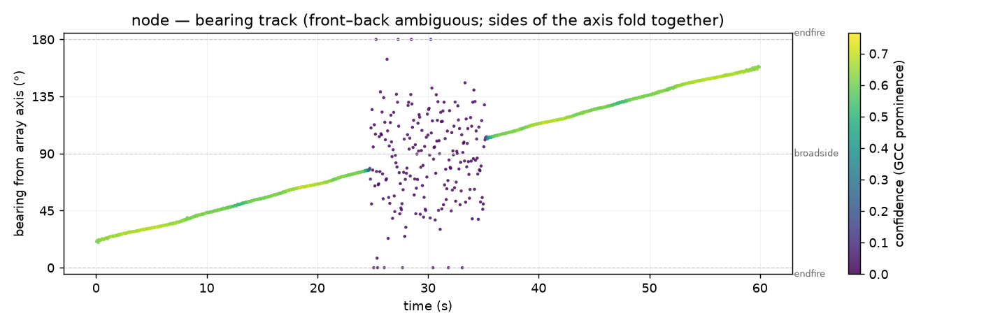
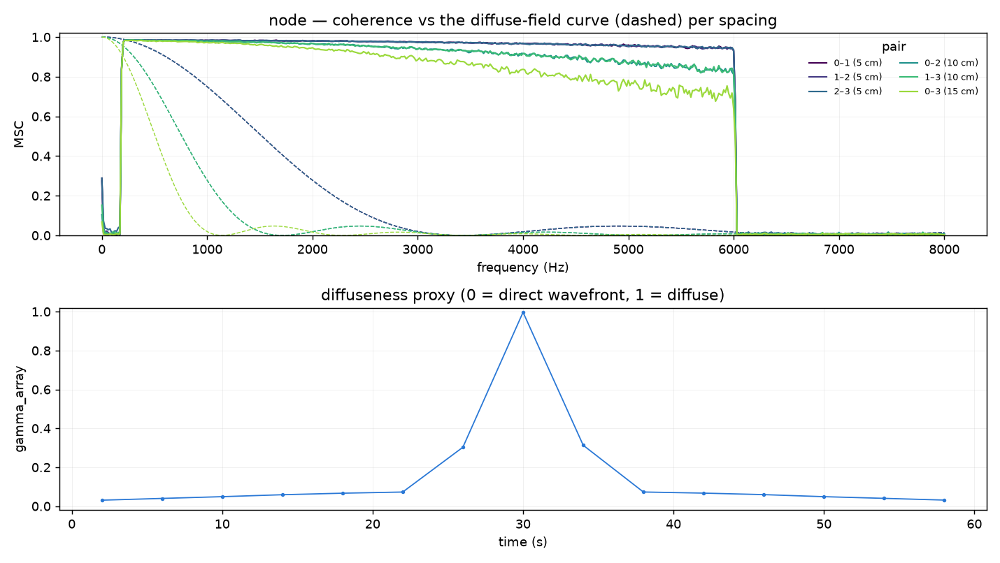
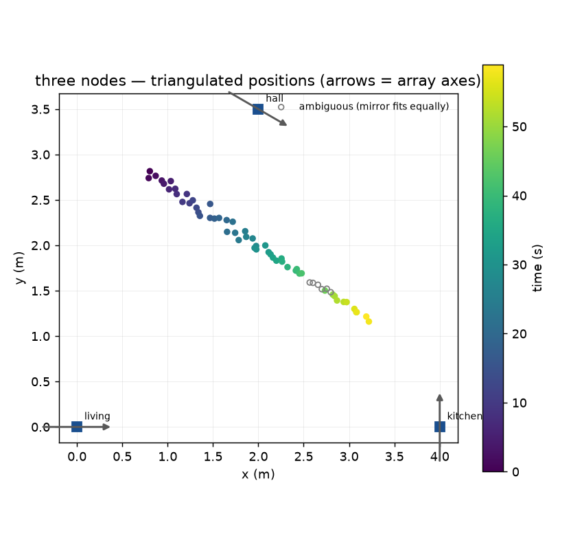

# Spaced-microphone array

The toolbox reads space in three ways, differing in where the microphones
sit. [Spatial analysis](spatial.md) reads a soundfield sampled at one point
— co-located ambisonic capsules — and asks *from which direction*; the
[multi-room acoustic network](network.md) reads one microphone per room and
asks *through which fabric*; `array` sits between them: a handful of spaced
omnis in one room, the SINS nodes' linear four-MEMS arrays being the model
case. Across a spaced array a wavefront arrives at each capsule at a
slightly different time, and the pattern of those arrival-time differences
carries a bearing; how coherent the channels remain across frequency
carries a direct-versus-diffuse reading. Neither needs a soundfield
microphone to have been present.



```bash
ambiscape array node.wav --geometry geometry.json
#   4 mics, 6 pairs, 1199 frames of 0.100 s
#   bearing median 62.1° from the axis (IQR 4.0°), confident frames 81% — front-back ambiguous, endfire-blind
#   gamma_array median 0.24 (0 = direct wavefront, 1 = diffuse; spaced-omni proxy, not the FOA psi)
#   wrote analysis/array.json and 2 figure(s)

ambiscape array node.wav --spacing 0.05      # uniform linear shortcut
```

The geometry file gives mic positions in metres (and optionally the speed
of sound); a flat list is read as positions along one line:

```json
{"mics": [[0.0, 0.0], [0.05, 0.0], [0.10, 0.0], [0.15, 0.0]], "c": 343.0}
```

## How it works

- **TDOA** (`tdoa`) — every frame (default 100 ms, hopped by half) is
  Hann-windowed and, per mic pair, the PHAT-weighted cross-power spectrum
  is inverted to a generalised cross-correlation (GCC-PHAT). The peak is
  searched only over physically possible lags (± spacing / c) and refined
  by parabolic interpolation. Convention: `tau_s[frame, pair] = t_i − t_j`
  for pair `(i, j)`, positive when the wavefront reaches mic *j* first.
  Each estimate carries the GCC peak height (1 for a clean single delay,
  near 0 for decorrelated channels) and its *prominence* over the
  strongest rival lag — the confidence base.
- **Bearing** (`bearing`) — for mics on one line with axis *u*, a plane
  wave from cone angle θ gives `tau_ij = −(s_i − s_j) cos θ / c`, so each
  frame's `cos θ` is a prominence-weighted least-squares fit across all
  pairs. Bearings run 0–180° from the axis (0/180 = endfire, 90 =
  broadside); the confidence stream is the median GCC prominence across
  pairs, and frames whose fit falls outside |cos θ| ≤ 1 are flagged
  `clipped`.
- **Coherence profile** (`coherence_profile`) — per window (default 4 s)
  the magnitude-squared coherence of every pair versus frequency, next to
  the analytic diffuse-field curve for spaced omnis at that spacing,
  `sinc(2 f d / c)²`.
- **Diffuseness proxy** (`gamma_array`) — per window, the energy-weighted
  excess of measured coherence over the diffuse curve (taken where the
  curve has fallen below 0.5, so the spacing is informative) is normalised
  to a directness reading; `gamma_array` is one minus its median across
  pairs: 0 when a coherent wavefront crosses the array, 1 when coherence
  sits at or below the diffuse prediction.



## Honest limits

- **Front–back ambiguity** — a linear array observes only the cone angle:
  the two sides of its axis fold onto one bearing, and nothing in the data
  can unfold them. Triangulation resolves the fold only when the node
  geometry breaks the mirror symmetry (see below).
- **Endfire blindness** — near 0° and 180° the delay–angle mapping
  flattens (`dτ/dθ → 0`), so endfire bearings are low-resolution even at
  high confidence, and fits pushed past the physical limit are clipped to
  the endfire and flagged.
- **`gamma_array` is a proxy** — it is built from spaced-omni coherence
  deviations and is deliberately named apart from the first-order-ambisonic
  diffuseness ψ (`diffuse` in the feature cache), an energetic soundfield
  measure at a single point. The two agree in tendency, not in value; do
  not pool them in one column.
- **One clock per node** — TDOAs compare channels of one interface, so
  sample-synchronous capture is assumed within a node. Across nodes only
  bearings are combined, never sample times.

## What it produces

- `array.json` — geometry, per-pair median TDOAs (ms), bearing summary
  over the confident frames (median, IQR, confident fraction), and the
  `gamma_array` median and IQR.
- `array_bearing.png` — the bearing track, time × bearing with the
  confidence as colour (linear geometries only).
- `array_coherence.png` — measured coherence per spacing against the
  dashed diffuse-field curves, over the `gamma_array` timeline.

## Triangulation across nodes

With two or more nodes bearing on the same event, `triangulate` intersects
the bearing streams on a floor plan by weighted least squares — a library
call, since it needs several recordings on a shared clock. The floor plan
gives each node's position and the world direction of its array axis
(anticlockwise from +x, first mic towards last):

```json
{"nodes": [
  {"name": "living",  "pos": [0.0, 0.0], "axis_deg": 0.0},
  {"name": "kitchen", "pos": [4.0, 0.0], "axis_deg": 90.0}
]}
```

Each linear-array bearing admits two world rays, `axis_deg ± bearing`;
every sign combination is solved and the one with the smallest residual
wins, with rays that would place the source behind a node rejected. When
the runner-up fits almost as well — parallel array axes make the two sides
genuinely indistinguishable — the fix is flagged `ambiguous` rather than
silently resolved. With exactly two nodes any two non-parallel rays meet
exactly, so only mirror rays that fall behind a node can be eliminated;
a third node makes the residual itself discriminating. The residual (RMS ray-to-point distance) is the coarse
uncertainty: treat each position as a blob of about that radius, and
distrust fixes whose intersection angle is small.

A worked synthetic example, with the bearing streams built directly from
the plan geometry (in practice they come from `bearing(tdoa(...))` per
node):

```python
import numpy as np
from ambiscape import array

plan = {"nodes": [
    {"name": "living",  "pos": [0.0, 0.0], "axis_deg": 0.0},
    {"name": "kitchen", "pos": [4.0, 0.0], "axis_deg": 90.0},
]}

def stream(pos, axis_deg, source, n=60):
    """The bearing a node at ``pos`` would report for ``source``."""
    v = np.subtract(source, pos)
    world = np.degrees(np.arctan2(v[1], v[0]))
    theta = abs((world - axis_deg + 180) % 360 - 180)   # cone angle
    return {"t": np.arange(n, dtype=float),
            "bearing_deg": np.full(n, theta),
            "confidence": np.full(n, 0.8),
            "clipped": np.zeros(n, bool)}

source = (1.5, 2.0)
tri = array.triangulate([stream((0, 0), 0.0, source),
                         stream((4, 0), 90.0, source)], plan)
tri["xy"][0]                                  # -> [1.5, 2.0]
array.triangulate_figure(tri, plan, "triangulation.png")
```



## When the spacing was never written down

Everything above needs `load_geometry` — the mic positions in metres. Plenty of
archives do not have them. `near_source_index` is the fallback: mean
inter-channel coherence in one band, averaged over every channel pair, assuming
nothing about which channel sits where.

```python
from ambiscape.array import near_source_index
v = near_source_index(x, fs, band=(500.0, 1000.0))   # x is (samples, channels)
```

It answers one question — how directional is this moment — and it answers it
without calibration, because a ratio between two channels of one device divides
that device's gain out. On a network of uncalibrated nodes that is worth a good
deal: on the SINS corpus a single fixed threshold, no per-node tuning, separates
loud activity from an empty room at 95.5 % across twelve nodes.

**It is not an occupancy detector.** Over 749 labelled minutes of that corpus a
television playing to an empty room scored higher than any class with a person
in it (0.717 against 0.678 for a vacuum cleaner), and a person working quietly
scored 0.365 against 0.247 for an empty room. It detects a near *sound source*.
A loudspeaker is one; a silent person is not.

Two practical points. Keep `band` below the array's spatial aliasing limit,
`c / 2d` — under about 2 kHz is safe for capsules a few centimetres apart, and
a band that is too high collapses towards zero for every input alike. And the
reading is comparable only against itself and against arrays of the same build:
there is no absolute scale, which is the price of taking no geometry.

## Programmatic helpers

`ambiscape.array` exposes the pieces directly: `load_geometry`, `tdoa`,
`bearing`, `bearing_figure`, `near_source_index`, `coherence_profile`,
`coherence_figure`, `load_plan`, `triangulate`, `triangulate_figure`, and
`run_array`. See the API reference.
