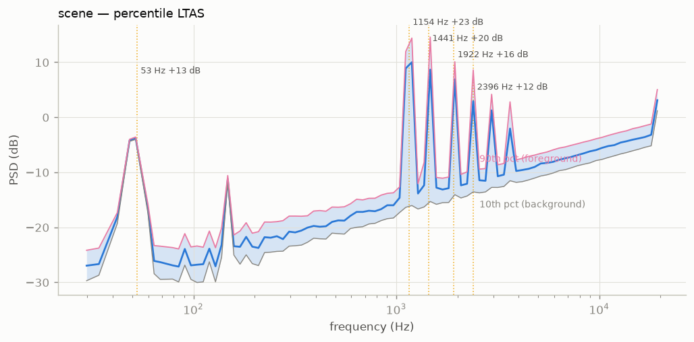

# Features and descriptors

## Streaming feature extraction

Files are read in 60-second blocks and never held whole in memory.
Per take, cached as `.npz`:

| Rate | Features |
|---|---|
| 125 ms | fast RMS level on W, unweighted and A-weighted (IEC 61672 bilinear IIR) |
| 1 s | octave-band powers (31.5 Hz–16 kHz), spectral centroid and flatness (50 Hz–16 kHz), 96-band log-frequency spectrogram row, per-octave pseudo-intensity vectors, broadband DOA (azimuth/elevation, 80–3000 Hz), diffuseness ψ |
| 1 min | full-resolution (5.9 Hz bins) mean power spectrum — for narrowband hum tracking, comb/fingerprint analysis, room modes |

Spectra come from Welch-style averaged 8192-point Hann FFTs at 0.1 s hops.

## Spatial estimators

The pseudo-intensity vector is
`I(f) = Re{ W*(f) · [X, Y, Z](f) }`, integrated over 80–3000 Hz (below the
array's spatial-aliasing region, above wind/handling rumble). Azimuth and
elevation come from its direction; diffuseness is

ψ = 1 − 2‖⟨Re W*·v⟩‖ / ⟨|W|² + ‖v‖²⟩

which is 0 for a single plane wave and 1 for an ideally diffuse field.
Directional statistics over time use circular means and the resultant
length R (0 = no concentration, 1 = all energy from one bearing).
Foreground/background splits use energy quartiles (loudest vs quietest
25 % of seconds).

## Session descriptors (`summarize`)

The conventions are frozen (matching the Intercontinental-database
reports), so that rows stay comparable across studies:

- **Leq, LAeq** (energy means of the fast level), **LAeq trimmed** (the
  same A-weighted energy mean with the loudest 5 % of frames discarded,
  `laeq_trim5_dbfs`), L10/L50/L90 exceedance percentiles, dynamics
  L10−L90;
- **events**: fast level ≥ 8 dB above a running background (10th percentile
  in a sliding 60 s window) for ≥ 0.25 s, giving rate, count and median
  duration;
- spectral centroid and flatness medians;
- ψ median and IQR; energy-weighted mean azimuth and R; median foreground
  elevation.

### Reading energy averages

Leq and LAeq are means of squared pressure, so they are decided by the
loudest frames in the span rather than by the typical one. In a quiet
room the distance between those two is enormous: a single slammed door
can carry more energy than the hour of background it interrupts, and the
average then reports the door. For scale, replacing 0.02 % of the frames
of a week-long domestic recording with full-scale material—sixteen frames
in ninety-odd thousand—moves that week's LAeq by more than 4 dB and its
Leq by nearly 3 dB, while L10, L50, L90, the dynamics L10−L90 and the
trimmed LAeq stay bit-identical. Nothing about that arithmetic is peculiar to
artefacts; a handful of genuine loud events does the same thing, which is
why an energy average alone cannot be read as a description of a quiet
space.

Practical consequences:

- **Never quote LAeq on its own.** Report it beside the trimmed level
  (`laeq_trim5_dbfs`) or a percentile. Agreement between the two says the
  average describes the span; a large gap says it describes a few moments,
  and both numbers are then worth printing.
- **In quiet rooms, lead with the percentiles.** L50 and L90 and the
  dynamic range L10−L90 are the primary descriptors of a background, with
  LAeq as the supporting energy figure. Comparisons between periods, rooms
  or nodes are stable on percentiles and fragile on energy means, which can
  differ by several decibels for reasons that have nothing to do with the
  quality being compared.
- **Descriptors built on LAeq inherit the fragility.** Emergence
  (LAeq − LA90) and any level-based day/night or state contrast move with
  the loudest frames; the trimmed level gives the same contrast without
  them.
- **Percentile levels have their own failure mode.** A low percentile can
  measure the recorder rather than the room—see the sensor-noise-floor
  guard below and the `floor_suspect` flag in `summary.json` before
  trusting L90 in a quiet high-band scene.

!!! tip "Reading ψ and R together"
    High ψ + high R = diffuse but anisotropic (an airport hall that
    "leans" one way). Low ψ + high R = a point-source room (one running
    machine). Low R with any ψ = scattered sources.

## Spectral foreground (per-band background)

`background.band_background` runs a low-percentile filter per log band
(default: 10th percentile over 300 s), from the cached 1 Hz `logspec`, with
no audio pass. On top of it:

- **foreground fraction**—the share of total power sitting > 3 dB above
  the spectral background, per second (steady scenes score low even when
  loud; transient-dominated scenes score high even when quiet);
- **spectral events**—connected time × band regions of ≥ 6 dB exceedance:
  band-limited events (a distant bell over traffic, a bird band, a beep)
  that the broadband ±8 dB detector never sees. Each carries onset,
  duration, band span, and peak rise.

`analyze` appends `fg_fraction_median`, `fg_fraction_p90`,
`spectral_events_per_min`, and `spectral_event_median_dur_s` to the summary.

## Sensor-noise-floor guard

A low-percentile level can measure the recorder rather than the room. In
the SINS sensor-network corpus the 4–8 kHz background floor of a living
room is flat to 0.8 dB across a full week (0.56 dB between six separate
nights), while every band below 1 kHz varies by 2.4–5.3 dB over the same
nights: the top of the spectrum is microphone self-noise, and A-weighting
emphasises exactly that region, so LA90 there measures the instrument.

`analysis.floor_suspicion` (run as part of every `summarize`) checks each
octave band centred at 2 kHz and above: the session is cut into 300 s
chunks, each chunk's 10th-percentile band level is its floor, and the
temporal spread is taken as the median minus the 5th-percentile chunk
floor — a low-tail statistic, so chunks whose floor is raised by activity
do not hide a pinned quiet-time floor. A spread under **1.5 dB** flags the
band: the threshold sits between the SINS self-noise band (≤ 0.8 dB) and
the quietest genuinely acoustic bands there (≥ 2.4 dB), with at least
0.7 dB of margin to each side. `summary.json` gains `floor_suspect`
(boolean), the affected band range `floor_suspect_lo_hz` /
`floor_suspect_hi_hz`, and `floor_spread_db`; when the flag fires, the
session README carries a warning that L90-derived descriptors in that
range may reflect the instrument, not the room.

This is an annotation, not a correction — no descriptor value changes.
Sessions shorter than six chunks (30 min) are never flagged, and bands
with no content below the Nyquist frequency are excluded.

## Modulation profile (`modspec`)

Environmental rhythm at three scales from cached envelopes: micro
(0.5–20 Hz strike/speech-rate rhythm, from the 20 ms `env_hi` envelope),
meso (0.01–0.5 Hz: traffic waves, surf), macro (duty cycles below
0.01 Hz). Per scale: a log-frequency modulation spectrum, the dominant
modulation frequency and its prominence, and a band modulation depth; plus a
windowed "rhythm spectrogram" of the session. Caches from extractor
versions without `env_hi` fall back to the 8 Hz fast level (micro < 4 Hz).

## Tonality and harmonicity (`tonality`)

From the per-minute mean PSD: prominent narrowband peaks are linked into
tonal tracks (hums, bell partials and beeps, with duration and cents
drift); a harmonic sieve finds the best f0 per minute and scores
harmonicity (bells score low, since their partial series is not harmonic);
tonal energy folds onto a 12-bin pitch-class profile ("what key does
the soundscape hum in").

## Spatial dynamics (`spatial`)

Per-octave directness (|pseudo-intensity| / band power, the spatial
analogue of foreground/background), pass-by detection (level events
whose azimuth sweeps monotonically: moving sources with rate and
direction), and the azimuth organisation timeline R(t), which is the
windowed, energy-weighted circular concentration of the direction of arrival.

## Schedule matching (`schedule`)

Folds event streams at civic periods (minute, 5-min, quarter, half-hour,
hour, day) and scores each with circular statistics. Read `n_cycles`
before trusting a match: R is trivially 1 when all events fall inside one
grid cycle. `schedule.clock_offset` turns an event of known wall-clock
time into the `clock_offset_s` calibration value.

## Event timbre templates (`timbre`)

Each spectral event gets a fingerprint—mel-band rise spectrum (what
appeared) plus per-band decay slope (how it faded)—and fingerprints
are clustered by correlation into recurring event classes: "the same sound
again" across a session, transparent and corpus-comparable, no ML.

## Masking (`background.masking_index`)

Floor elevation per band between a source-active and a quiet state: how
much a dominant source hides the rest of the field, and in which bands.
Often frequency-selective, as when the Haarlem bells elevate the typical
floor 9–14 dB in their partial bands while the rest of the spectrum stays
nearly free.

## MIR views (`music`, optional)

With `pip install "ambiscape[music]"`, `ambiscape music` renders the
MIR-standard tempogram (onset autocorrelation in BPM, with librosa's
octave-resolved global tempo) and chromagram, which cross-check the
built-in windowed-ACF tempogram and pitch-class profile.

## Segment selection

`pick_segments` proposes representative windows for listening, archiving,
ISO indicators, or ambiviz rendering: the quietest, the most active, the
typical, and (when a >6 dB state change exists) the transition.
