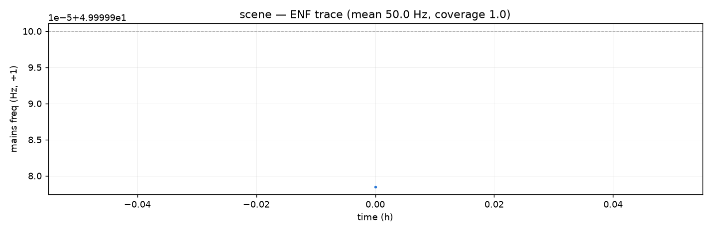

# Mains hum and the grid frequency (ENF)

Indoor recordings hum with the electricity supply: 50 Hz (nominal, Europe)
and harmonics, with magnetostriction strongest at 100 Hz. The grid's
*actual* frequency wanders by tens of millihertz as load and generation
balance, and that wandering value is the electric network frequency, or
ENF. A long recording carries the wander as a continuous, involuntary log
of the grid. The `enf` module reads it; a whole night of domestic hum
tends to track the grid to within tens of millihertz.

```bash
ambiscape enf SESSION/ --nominal 50      # 60 in the Americas
```

`--step` and `--win` set the seconds between windows (default 300) and
the window length (default 60); the command writes `enf.json` and
`enf.png` into `analysis/`.

The cached per-minute spectra are far too coarse for this (5.9 Hz bins);
`ambiscape.enf` makes its own pass over the raw W channel.

## Tracking

```python
from ambiscape import enf

tr = enf.enf_track(sess, step_s=300, win_s=60, harmonics=(1, 2))
enf.enf_summary(tr)
# {'mean_hz': 49.9958, 'sd_mhz': 21.0, 'max_dev_mhz': 88.0,
#  'coverage': 1.0, 'harmonic_agreement_mhz': 0.9, ...}
```



`hum_peak` measures one window (zero-padded FFT + parabolic interpolation
→ millihertz precision on a 60 s window); `enf_track` walks a whole
session, skipping the sliver reads that recorders' overlapping 2 GB splits
produce at take boundaries.

## Reading the summary

- **`harmonic_agreement_mhz`** is the authenticity check: the 50 Hz and
  100 Hz hum are independent acoustic lines driven by the same electrical
  frequency, so millihertz agreement confirms you are looking at the grid
  and not at a machine. In Haarlem a second stable line at ~49.8 Hz—a
  rotor just under synchronous speed—masqueraded as mains in coarse
  spectra; its wander was 17× the grid's and it tracked nothing.
- A Continental-Europe trace should sit near 50.000 Hz with SD ~20 mHz,
  rarely leaving ±50 mHz (the ENTSO-E normal band). Systematic offsets
  mean either a mechanical line or a recorder sample-clock error.
- **Forensics:** matched against published grid-frequency archives, an ENF
  trace timestamps a recording to the second, independently of the
  recorder clock, which gives a cross-check for `schedule.clock_offset`.

## As a corpus descriptor

`enf_summary`'s `median_rise_db` and `coverage` say how electrified a room
sounds: a machine-room measured +45 dB of 50 Hz line, a quiet hotel room
essentially none. Compare across sessions before interpreting any
low-frequency tonal finding, since the hum is in nearly every indoor
recording.

!!! warning "Coverage is not a location proxy"
    It is tempting to read `coverage` as proximity to mains, and so as a
    physical check on whether a session happened indoors. It does not work.
    Across 365 daily recordings sorted into seven kinds of place, the group
    medians ran from 0.590 down to 0.475 — a total range of 0.115 against a
    within-group interquartile width of 0.260, with Kruskal–Wallis
    returning H = 3.7 at p = 0.72. Outdoor and semi-open sessions ranked
    sixth of seven, in among the indoor groups rather than below them.

    Nothing was wrong with the ENF measurement over that year: the grid was
    recovered on 364 of 365 days at a median 49.9913 Hz. What coverage
    tracks is the recording — gain, wind, the recorder's own floor — not
    the room. It is also a fraction of windows clearing a threshold, so it
    depends on `win_s`, `step_s` and `min_rise_db`, and two coverages are
    comparable only where all three match.

    A between-group difference means nothing until it is put beside the
    within-group spread. And a single extreme day deserves a look at the
    file before it is believed: the lowest reading of that year came from a
    WAV whose header declared 690 seconds over 379 MB of audio and returned
    no frames at all to libsndfile, without raising anything.
