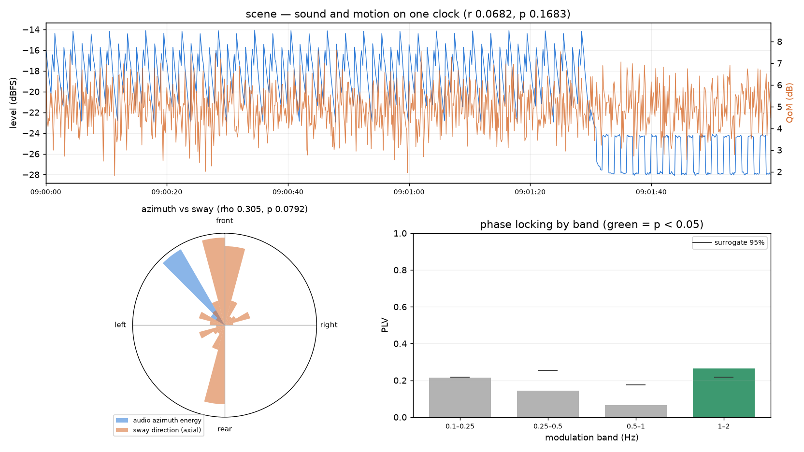

# Sound–motion entrainment

Does a body in the room move *with* the room's sound? `ambiscape entrain`
joins an analysed session with a body-motion accelerometer series on one
common clock and computes three entrainment measures, following the
crossmodal method of Guo, Riaz & Jensenius (CMMR 2025) — the AMBIENT
project's sound–motion join.

```bash
ambiscape entrain <session-folder> --motion motion.csv   # needs a prior analyze run
```

`--surrogates N` sets the number of circular-shift surrogates per p-value
(default 200); `-o` picks the output directory.

There is no audio pass: the sound side comes from the cached 125 ms fast
level and per-second azimuth. Writes `entrain.json` and `entrain.png`
(aligned level/QoM timelines, an azimuth-vs-sway rose, and PLV by
modulation band with the surrogate significance floor), and folds
`ent_`-prefixed descriptors into an existing `summary.json` — the same
multimodal join as the [vision module](vision.md), so the corpus catalog
picks them up.



`entrain.json` holds four blocks — `temporal`, `directional`, `plv`, and
`summary` — plus a `_method_note`. The `summary` block is what lands in
`summary.json`: `ent_overlap_min`, `ent_r_level_qom` and `ent_r_p`,
`ent_az_sway_rho` and `ent_az_sway_p`, and `ent_plv_max` with
`ent_plv_max_band_hz` and `ent_plv_max_p`.

## Motion input

A device-agnostic CSV/TSV: one timestamp column (ISO 8601 or plain
seconds) plus accelerometer x/y/z columns, in any consistent unit (g or
m/s²) — gravity is removed internally and every measure is scale-free, so
the unit never enters a result. Column names are matched loosely
(`acc_x`, `ax`, `X (g)` all work). ISO timestamps land on the session's
absolute clock (both devices are assumed set to the same local time; use
`calibration.json` clock offsets for a drifting recorder); a plain
seconds column that does not overlap the audio span is taken as relative
and aligned to the start of the audio.

Quantity of motion (QoM) is jerk magnitude after gravity removal (a
0.25 Hz low-pass), per Riaz's micromotion method, and the horizontal
plane is defined by the gravity estimate itself — the sensor can sit at
any orientation on the body.

## The three measures

- **Temporal correlation** (`temporal_correlation`): Pearson r between
  the 125 ms fast level (dB) and log-QoM. Significance comes from
  *circular time-shift* surrogates, not naive shuffling — shuffling would
  destroy the autocorrelation both series have and wildly overstate
  significance.
- **Directional correlation** (`directional_correlation`): the
  Jammalamadaka–SenGupta circular correlation between the audio's azimuth
  and the direction of horizontal micromotion (the per-frame principal
  axis, an axial quantity, angle-doubled before correlating). It is
  rotation-invariant, so the mic frame and the sensor frame need no
  alignment — but the *sign* of rho depends on frame handedness, so judge
  coupling by |rho| and p. Only frames above median energy in both
  streams enter the statistic. Requires directional audio (ambisonic, or
  stereo's lateral cue); skipped for mono.
- **Phase-locking value** (`plv`): per modulation band from 0.1 to 4 Hz,
  the Hilbert-phase locking between the audio's envelope modulation and
  the motion oscillation, each band with its own surrogate p-value and
  null 95th percentile. A caveat inherited from the surrogate logic: a
  *strictly* periodic pair (a metronome and a metronomic swayer) is
  indistinguishable from its own time-shifted surrogates, so PLV
  significance speaks to locking onto *wandering* real-world modulation,
  which is the conservative behaviour you want.

!!! warning "Rotation invariance is not reflection invariance"
    Mirroring one of the two angle series flips the coefficient's sign and
    leaves its magnitude exactly unchanged, so judging by |rho| places the
    blind spot precisely where a handedness error lands. A recorder mounted
    upside down writes Y inverted and its horizontal bearing becomes its own
    mirror image; no offset recovers that, and neither does a search over
    rotations, because a reflection is not in the set being searched. Such a
    search returns a poor best fit rather than a complaint. Settle handedness
    from how the rig was mounted, and from whether the recorder already
    compensated for it.

!!! warning "Whose frame is the azimuth in?"
    A recorder travelling on the same body as the sensor is partly measuring
    that body's posture, and will correlate with its motion for reasons that
    have nothing to do with the soundscape. Settle that first with
    [`spatial.frame_reference_test`](spatial.md#which-frame-is-the-bearing-in);
    a directional correlation from a body-referenced rig is not a fact about
    the room.

!!! warning "A best-over-shifts figure is positive by construction"
    The circular shifts in this module are the null and never the answer. It
    is a short step to quoting the best-fitting shift's statistic instead,
    and that number rises with the number of shifts tried and with how smooth
    the two series are. On a year of daily recordings, the best of 72
    circular shifts scored *higher* on deliberately mismatched day pairs than
    on real ones — 0.599 against 0.494 — after three separate hypotheses
    about the apparatus had been tested and none of them was the problem. If
    a maximum over alignments must be reported, run the same search over
    pairs known not to belong together and quote the difference.

## In notebooks

```python
import ambiscape as asc
from ambiscape import entrain

sess = asc.open_session("2026-07-15-Haarlem-loft")
J = entrain.join(sess, "motion.csv")        # common-clock series dict
doc = entrain.analyze_entrainment(sess, "motion.csv")
doc["summary"]                              # ent_* rows for summary.json
```

`join` returns the aligned series themselves (`t`, `level_db`, `qom`,
`az_deg`, `sway_deg`, `sway_pow` at 8 Hz) for custom analyses beyond the
three standard measures.
