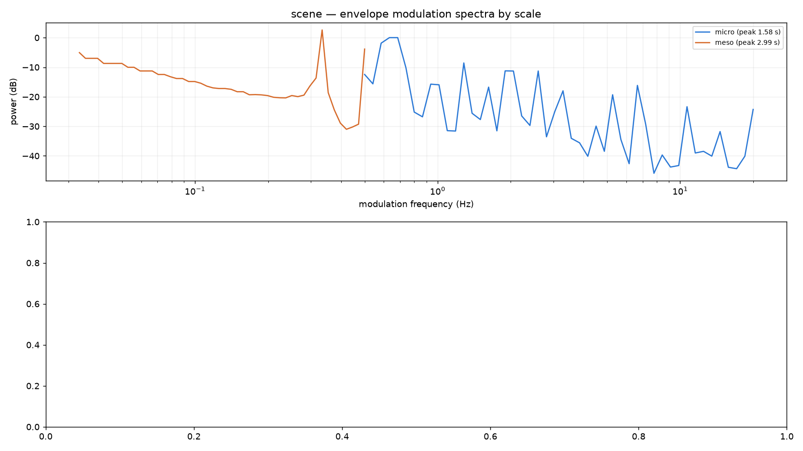

# Environmental rhythm (modulation profile)

A soundscape is rhythmic on very different time scales at once: bell strikes
and footsteps beat at a few hertz, traffic waves and surf breathe over tens
of seconds, and machines and human activity switch on a duty cycle of
minutes to hours. `ambiscape modspec` measures all three from the cached
envelopes — no second pass over audio — as a **modulation profile**: a
log-frequency modulation spectrum per scale, plus a rhythm spectrogram of
the whole session.



```bash
ambiscape modspec <session-folder>   # needs a prior analyze run
```

Writes `modulation.json` (per-scale dominant modulation frequency, period,
prominence and band modulation depth, plus the raw spectra) and
`modulation_profile.png` (the spectra by scale over a 10-minute-window
rhythm spectrogram, in dB relative to each window's median).

## The three scales

- **micro** (0.5–20 Hz) from the 20 ms broadband envelope — strike
  patterns, footstep cadence, flutter. This needs the high-rate `env_hi`
  cache (extractor ≥ 0.2); on older caches micro falls back to the fast
  level and tops out at 4 Hz (flagged as `micro_limited` in the JSON).
- **meso** (0.01–0.5 Hz) from the 125 ms fast level — traffic waves, surf,
  wind gusts, conversational turn-taking.
- **macro** (below 0.01 Hz, floor set by session length) from the 1 s RMS —
  ventilation and appliance duty cycles, diel activity.

Each scale reports `peak_freq_hz`, `peak_period_s`, `peak_prominence_db`
(peak over the band median) and `modulation_depth` (band-integrated
modulation power of the unit-mean envelope). A sharp, prominent peak means
periodic structure; a flat spectrum means the level just wanders.

## In Python

```python
from ambiscape import modulation

prof = modulation.profile(F)          # F = load_features(...)
prof["scales"]["meso"]
# {'peak_freq_hz': 0.033, 'peak_period_s': 30.0,
#  'peak_prominence_db': 7.4, 'modulation_depth': 0.21}
```

`modulation.modulation_spectrogram(env, dt)` returns the windowed version
directly — `(t_centers, mod_freqs, S)` — if you want to build the rhythm
spectrogram from a custom envelope.
