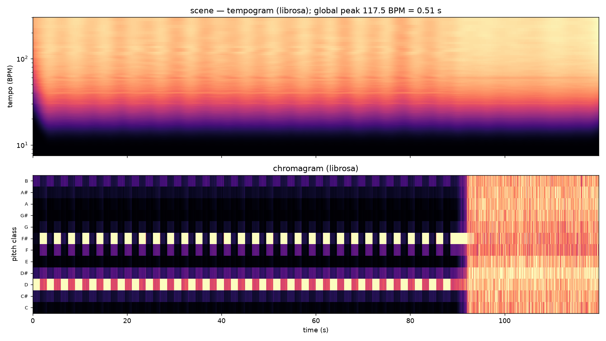

# MIR views: tempogram and chromagram

`ambiscape music` adds the two standard music-information-retrieval views on
top of the built-in analyses: the **tempogram** (onset autocorrelation over
time, in BPM) and the **chromagram** (12-bin pitch-class energy over time).
They are the time-resolved, MIR-conventional counterparts of the built-in
`rhythm` tempogram and `tonality.pitch_class_profile`, useful as an
independent cross-check and for readers who expect the librosa picture.



```bash
ambiscape music <session-folder> --t0 60 --dur 1500   # needs the [music] extra
```

Reads audio directly (not the feature cache), so it needs
`pip install "ambiscape[music]"`. `--t0` and `--dur` (seconds into the first
take) bound the analysed span; a 25-minute file takes on the order of a
minute. Analysis runs on the mono W reference resampled to 22.05 kHz.

Writes `music.json` (`tempo_bpm_global` and `tempo_period_s` from librosa's
global tempo estimate, `chroma_mean` — the 12 pitch classes normalised to
sum to 1 — and `top_pitch_classes`) and `music.png` (the tempogram over the
chromagram).

## In Python

```python
from ambiscape import music

y, sr = music.load_w(sess.takes[0], t0=60, dur=1500)
times, bpm, T, tempo = music.tempogram(y, sr)   # T is the tempogram matrix
tc, C = music.chromagram(y, sr)                 # C is 12 x n_frames
```

`tempogram` returns librosa's global `tempo` alongside the matrix, which
resolves the octave ambiguity a raw tempogram argmax suffers from. Because
this is the MIR-standard estimator, a disagreement with the built-in
`rhythm` tempo is diagnostic rather than an error — the two use different
onset models.
