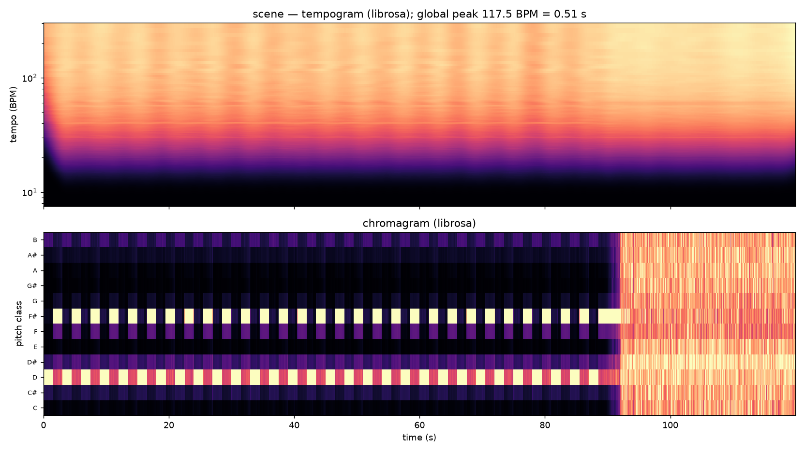

# MIR views: tempogram and chromagram

`ambiscape music` adds the two standard music-information-retrieval views on
top of the built-in analyses: the tempogram (onset autocorrelation over
time, in BPM) and the chromagram (12-bin pitch-class energy over time).
They are the time-resolved, MIR-conventional counterparts of the built-in
`rhythm` tempogram and `tonality.pitch_class_profile`, useful as an
independent cross-check and for readers who expect the librosa picture.



```bash
ambiscape music <session-folder> --t0 60 --dur 1500   # needs the [music] extra
```

Reads audio directly (not the feature cache), so it needs
`pip install "ambiscape[music]"`. `--t0` and `--dur` (seconds into the first
take) bound the analysed span; a 25-minute file takes on the order of a
minute. Analysis runs on the mono W reference resampled to 22.05 kHz.

Writes `music.json` (`tempo_bpm_global` and `tempo_period_s` from librosa's
global tempo estimate, `chroma_mean`, which is the 12 pitch classes
normalised to sum to 1, and `top_pitch_classes`) and `music.png` (the
tempogram over the chromagram).

## In Python

```python
from ambiscape import music

y, sr = music.load_w(sess.takes[0], t0=60, dur=1500)
times, bpm, T, tempo = music.tempogram(y, sr)   # T is the tempogram matrix
tc, C = music.chromagram(y, sr)                 # C is 12 x n_frames
```

`tempogram` returns librosa's global `tempo` alongside the matrix, which
resolves the octave ambiguity a raw tempogram argmax suffers from. Because
this is the MIR-standard estimator, a disagreement with the built-in
`rhythm` tempo is diagnostic rather than an error, since the two use
different onset models.

## Circular views: pulse clarity and the circle of fifths

Three functions apply the [circular statistics](../api.md) machinery to
musical material. They were developed on a five-album solo-harp catalogue
(57 tracks) where conventional beat tracking fails outright.

```python
music.pulse_clarity(y, sr)
# {"R": 0.05, "period_s": 0.47, "period_bpm": 127.7, "rayleigh_p": ..., "n_onsets": 412}
```

**`pulse_clarity`** measures *metric lock* rather than tempo: onsets are
folded at the dominant period and the strength-weighted resultant length R
taken as the score, where 0 is free rubato and 1 metronomic. The period is chosen
among the envelope-ACF peak and its metrical octaves by maximising R itself
(folding 120 BPM onsets at the octave-below period would cancel the
resultant). Use it where a BPM number would be meaningless: rubato playing,
drones, ambient textures. One caveat: the single global period means slow
tempo drift also reads as low R.

```python
music.fifths_center(C.mean(1))          # one recording's tonal center + focus
music.tonal_center_spread([c1, c2, c3]) # how tightly a corpus clusters in key space
```

**`fifths_center`** places the 12 pitch classes a fifth apart around a
circle and takes the chroma-weighted resultant: the mean angle is the tonal
centre, R the tonal focus (diatonic material concentrates, chromatic or
inharmonic material smears). `tonal_center_spread` applies the same
resultant to *many* recordings' centres, near 1 for a repertoire that stays
in neighbouring keys, near 0 for one that wanders the circle. The
between-recording statistic must be circular, since key centres have no
meaningful linear mean: the average of C and B is not F sharp.

## Object-level Schaeffer profile

```python
music.tartyp_profile(y, sr)
# {"dist": {"N": 0.62, "N'": 0.35, "N''": 0.02, "Y": 0.01}, "n_objects": 803}
```

**`tartyp_profile`** segments a recording into onset-bounded sound objects
and classifies each on a simplified TARTYP grid—mass N (tonic) / Y
(variable) / X (complex) from spectral flatness and centroid drift, facture
held / impulse (`'`) / iteration (`''`) from duration and 4–20 Hz envelope
modulation—returning the share of sounding time per type. It is the
object-level counterpart of the regime-level `draft.schaeffer_hint`, and
feeds the same interpretive vocabulary as the
[taxonomy](taxonomy.md) figures (N→tonic, Y→tonic-complex,
X→complex/noise). The thresholds are signal proxies for aural categories,
calibrated on tonal instrumental material, so treat the output as a draft
for reduced listening, not a verdict.
