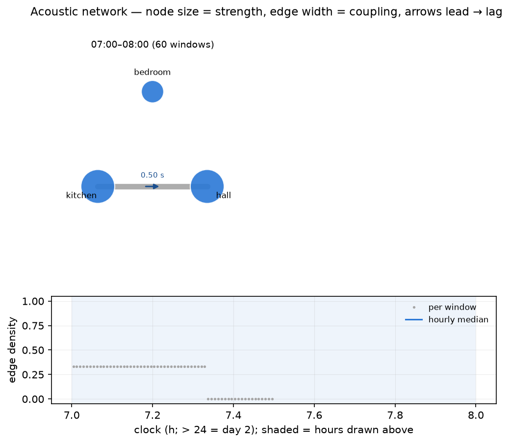

# Multi-room acoustic network

Ambisonics puts several capsules at one point and asks *from which
direction*; an acoustic network puts one recorder in each of several rooms of
a building on a common clock (the SINS deployment style) and asks *through
which fabric*: how strongly, and with what delay, does activity in one room
appear in the others. The rooms become nodes, the walls, doors and corridors
become edges, and the building reads as a graph whose shape changes over the
day — a closed door thins an edge, a shared ventilation run thickens one, and
the room everything couples to is the acoustic hub. Where
[`compare`](compare.md) aligns visits to one room across occasions, `network`
aligns rooms within one occasion; where [spatial analysis](spatial.md)
resolves directions inside a room and a [spaced-microphone
array](array.md) recovers bearings from a few spaced omnis, the network
resolves couplings between rooms.



Everything works from the cached 8 Hz fast A-weighted level streams of a
prior `analyze` run on each node session; no audio is reopened.

```bash
# one analysed session per recorder, all under one folder
ambiscape analyze house/kitchen
ambiscape analyze house/hall
ambiscape analyze house/bedroom
ambiscape network house
#   3 nodes, 214 windows of 120 s
#   edge density median 0.33, hub hall (strength 1.12)
#   strongest edge kitchen -> hall: coupling 0.78, lag 0.5 s
#   wrote house/analysis/network.json and house/analysis/network.png
```

## How it works

- **Common grid** — every node's fast A-weighted level stream is placed on
  one uniform 8 Hz clock grid (seconds since midnight of day 0; nodes dated
  on later days shift by whole days), with NaN where a node has no coverage.
- **Pairwise coupling** — the grid is cut into non-overlapping windows
  (`--win`, default 120 s); in each, every pair's mean- and trend-removed
  dB envelopes are cross-correlated over lags of ±`--max-lag` (default 4 s)
  and the peak is kept. That yields a per-window adjacency (coupling)
  matrix and an antisymmetric lag matrix; positive `lag_s[i, j]` means room
  *i* leads — sound appears there first.
- **Graph measures** (numpy only) — per window: node *strength* (summed
  coupling, the acoustic-hub reading), edge *density* (fraction of pairs at
  or above `--threshold`, default 0.35), and *transitivity* (the
  closed-triplet clustering indicator). All are also resolved by hour of
  day, so the graph's daily breathing is visible.

## What it produces

- `network.json` — median coupling and lag matrices, per-node strength, the
  hub, density and transitivity medians, an hourly breakdown, and the
  strongest pair with its lag.
- `network.png` — house graphs at representative hours (the quietest,
  median and busiest hours by density): node size = strength, edge width =
  coupling, arrowheads point from the leading room to the lagging one with
  the lag labelled in seconds; below, edge density across the whole
  deployment with an hourly median step.
- `net_` keys folded into `<folder>/analysis/summary.json` (created if
  absent) — `net_n_nodes`, `net_density_median`, `net_transitivity_median`,
  `net_hub_node`, `net_hub_strength`, `net_max_coupling`, `net_max_pair`,
  `net_max_lag_s` — so the building joins the [corpus
  catalogue](catalog.md) as one row.

## Reading the graph

- A **strong edge with near-zero lag** usually means a shared source
  (ventilation plant, street noise reaching both windows) rather than
  transmission from room to room.
- A **strong edge with a stable lag** points at a propagation or
  causation path: the kitchen's activity heard in the hall half a second
  later, morning after morning.
- The **hub** is the room acoustically closest to everything — often the
  circulation space. If the hub changes by hour, the house has different
  acoustic centres by day and night.
- **Density over the day** is a one-line occupancy signature of the whole
  building: empty houses decouple, activity couples.

Lags are searched over a few seconds because coupling here rides on
activity envelopes (events heard in several rooms), not on wavefronts;
recorder clock offsets of up to the search range are absorbed into the lag
estimate, so start recorders from one clock and treat larger offsets as a
capture problem.

## Programmatic helpers

`ambiscape.network` exposes the pieces directly: `load_network`,
`node_grid`, `pairwise_coupling`, `graph_measures`, `hourly_measures`,
`representative_hours`, `network_figure`, `network_summary_keys`, and
`run_network`. See the API reference.
