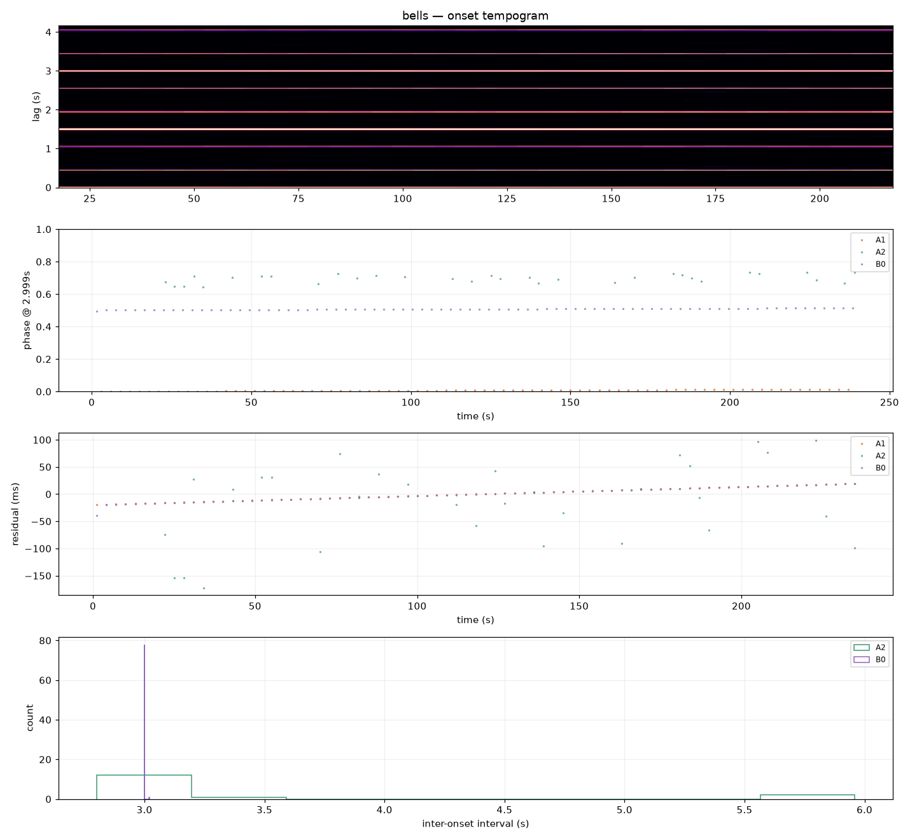

# Strike-level rhythm

`ambiscape rhythm <session-folder>` analyzes the rhythm of quasi-periodic
pitched sources — swinging or chimed bells, machine cycles, repeated signals —
at strike resolution (~20 ms), far below the 1 Hz grid of the standard
features. It needs a prior `analyze` run (it starts from the cached per-minute
mean PSD).


*The `rhythm_overview.png` four-panel figure: the onset tempogram (candidate
periods over time), the strike phases folded at the recovered cycle, the
per-cycle residual grid, and the inter-onset-interval histograms per stream.*

## Pipeline

1. **Partials** — narrowband peaks of the source(s), found by contrasting the
   mean spectrum of source-active minutes against quiet minutes
   (`rhythm.detect_partials`). Active/quiet minutes are auto-detected from
   1–2 kHz octave power (2-means threshold) or overridden with `--stop`.
2. **Streaming pass** — one extra pass over the audio storing, per 20 ms
   frame, the power envelope and pseudo-intensity at each partial plus a
   broadband onset function (`rhythm.partial_pass`).
3. **Sources** — partials are grouped into sources by correlating their
   rectified log-envelope derivatives: partials that rise together belong to
   the same strike stream (`rhythm.cluster_partials`).
4. **Strikes** — adaptive strongest-first onset picking per source, with the
   separation guard derived from the onset-function autocorrelation
   (`rhythm.acf_structure`, `rhythm.pick_strikes`) so weak between-strike
   peaks are rejected without a fixed threshold.
5. **Periodicity** — the cycle period from a Rayleigh point-process
   periodogram (resultant length over a period grid, harmonics included for
   multi-strike cycles), refined near the ACF fundamental to avoid
   subharmonics; sliding-window period track for drift
   (`rhythm.best_period`, `rhythm.period_track`).
6. **Repetition vs. variation** — strikes are folded into phase clusters
   (`rhythm.phase_clusters`) and laid on a rigid cycle grid
   (`rhythm.cycle_grid`): per-position hit rates, timing SD, slow wander vs.
   cycle-to-cycle jitter, lag-1 autocorrelation.
7. **Verification** — `rhythm.rise_spectrum` computes the strike-triggered
   post/pre spectral rise of any stream: a stream whose rise spectrum shows
   another source's partials is cross-talk, not an independent strike (such
   clusters are flagged as `crosstalk_suspects` in `rhythm.json`).
   `rhythm.strike_doa` gives per-stream azimuth/elevation from the
   pseudo-intensity at the source's own partials.

## Output

`analysis/rhythm_overview.png` (onset tempogram, phase fold, cycle-grid
residuals, IOI histograms) and `analysis/rhythm.json` (per-source partials,
period, phase clusters, DOA, per-position variation statistics, plus
circular statistics: per-stream `phase_stats` — R, circular SD, Rayleigh
p — and `phase_lock`, the per-strike relative phase between sources'
primary streams; R near 1 with a small circular SD means the sources are
mechanically phase-locked).

## Swing verification (`rhythm.partial_fm`)

A genuinely swinging bell Doppler-modulates its partials by a few cents at
the swing period; a chimed bell does not. `partial_fm` tracks a partial's
instantaneous frequency and demodulates at the cycle rate against an
off-rate control. In the Haarlem case study both bells show cycle-rate FM
20–70x above control (2.4 and 1.3 cents at the nominals) — both bells
physically swing, which makes their millisecond phase lock a genuine
mechanical-synchronization observation.

## Informed prior (distant / low-SNR sources)

Blind partial detection needs the source to dominate the active-vs-quiet
spectral rise. At two blocks' distance, under birds, bikes and traffic, it
fails — foreground events swamp the rise. Supply a **fixed prior** instead:

```bash
ambiscape rhythm <folder> --prior damiaatjes_prior.json --k 3.5 --min-gap 0.42
```

where the JSON carries a known partial list and A/B grouping:

```json
{ "partials_hz": [475.1, 597.7, 920.2, 1130.9, 1359.4, 1910.2, 2302.7, 2882.8],
  "groups": { "A": [475.1, 920.2, 1130.9], "B": [597.7, 1359.4, 2302.7] },
  "strike_k": 3.5, "min_gap_floor": 0.42 }
```

This bypasses `detect_partials` (the list becomes the tracked partials) and the
blind clustering (the grouping is fixed), while `strike_k` raises the
onset-picking threshold and `min_gap_floor` guards the intra-cycle separation —
both stabilise picking when the strike ODF is noisy. `rhythm.json` records the
prior and a `_method_note`. The library call is
`rhythm.run_session(sess, out, partials=[...], groups={...}, strike_k=3.5,
min_gap_floor=0.42)`. The prior is reusable across sessions of the same source:
the Damiaatjes prior derived from the close 2026-07-17 recording drives the
distant 07-18 and 07-21 analyses unchanged.

## Caveats

- Sources sharing most of their partials (unison bells) will merge into one
  stream; check `crosstalk_suspects` and the rise spectra before interpreting
  phase clusters as physical strikes. Coincident clusters are flagged on
  *both* sides — use `rise_spectrum` on each to decide which one is the real
  strike (the artifact's rise spectrum shows the other source's partials).
- Per-partial DOA in reflective environments (street canyons) is
  frequency-dependent; treat per-source azimuths as sector estimates, not
  bearings.
- Everything runs on the W channel except pseudo-intensity (AmbiX ACN
  W/Y/Z/X, as elsewhere in ambiscape).
