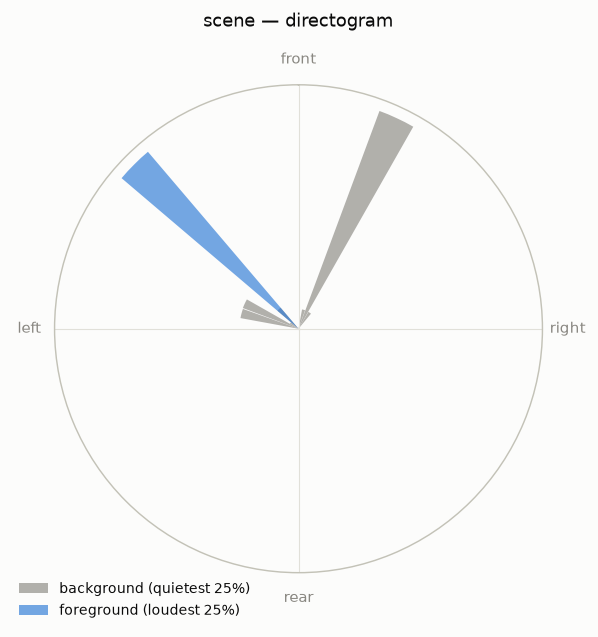

# Sessions and conventions

## The session model

A session is a folder of WAV files. ambiscape parses each file's BWF `bext`
chunk natively (no ffmpeg needed) for its origination date/time, and places
all *takes* on one absolute clock — seconds since the session's first
midnight. Recorder splits (2 GB FAT limits) chain seamlessly; genuinely
separate takes (a gap larger than ten minutes) are kept on the same clock
but rendered as separate panels in figures.

### Sessions vs. scenes

The folder-as-session model assumes every WAV in a folder belongs to one
recording occasion. A contributed corpus is often the opposite: one folder
per recordist, each holding many independent one-off **scenes** from
different places and dates. Open a single recording as its own scene with
`open_recording(path)` (day0 = that file's BWF date, name = the file stem),
or analyze a whole folder of them in one call:

```bash
ambiscape scenes CONTRIB/Microphone_1/   # one summary per WAV, keyed by filename
ambiscape catalog CONTRIB/Microphone_1/analysis/scenes/   # then compare them
```

Each scene is written as a catalog-ready mini-session, so `catalog` and
`longitudinal` work across them unchanged.

`read_span(session, t0, dur)` returns raw audio from anywhere on that
clock, transparently crossing file boundaries.

## Channel order: AmbiX vs FuMa

The Zoom H3-VR records first-order B-format in either **AmbiX** (ACN order
W, Y, Z, X — SN3D) or **FuMa** (W, X, Y, Z) mode. ambiscape reads the
recorder's `zTRK` tags from the `bext` description and sets the channel map
per take (`io.channel_order`). This matters: processing AmbiX data with a
FuMa map feeds the near-empty Z channel into the horizontal decode and
collapses all azimuth estimates onto a 0°/180° axis.

!!! warning
    If you inherit B-format files of unknown provenance, run
    `ambiscape probe` — it reports the detected convention. An azimuth
    distribution that hugs one axis across different rooms is the
    tell-tale sign of a convention mismatch.

## Direction conventions

- Azimuth: 0° = front (X+), +90° = left (Y+), ±180° = rear
  (counterclockwise positive). Elevation: positive up.
- All directions are **microphone-relative**. If you need world bearings,
  record the mic's orientation in the field (compass reading of the X+
  axis, or calibration claps from known positions — see the
  [wiki protocol](https://github.com/fourMs/ambiscape/wiki)).



## Levels

Levels are dBFS (uncalibrated) unless a `calibration.json` provides a
`dbfs_to_dbspl` offset. Within-session structure is exact either way;
between-session absolute comparisons without calibration are indicative
only.
