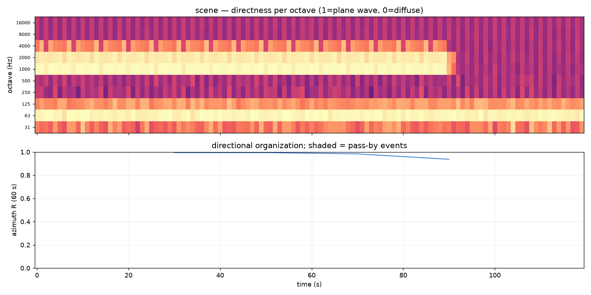

# Spatial dynamics

An ambisonic recording knows not just how loud a scene is but *where it
sounds from*, and how that direction moves. `ambiscape spatial` reads the
cached per-second spatial features — pseudo-intensity per octave, direction
of arrival, diffuseness — and reports three views that no mono corpus tool
can: the direct/diffuse split, moving-source pass-bys, and how
directionally organised the scene is over time.



```bash
ambiscape spatial <session-folder>   # needs a prior analyze run
```

No audio pass — everything comes from the feature cache. Writes
`spatial.json` (`directness_median_per_octave`, `azimuth_R_median` and its
IQR, and a list of `passbys`) and `spatial.png` (directness per octave over
the azimuth-organization timeline, with pass-by events shaded).

## The three views

- **Direct/diffuse split** (`direct_diffuse_split`) — per-octave directness
  in [0, 1], the ratio of pseudo-intensity magnitude to band power. A plane
  wave scores near 1, a diffuse field near 0: the spatial analogue of
  foreground versus background, resolved per frequency band.
- **Pass-by events** (`passby_events`) — level events whose per-second
  azimuth sweeps monotonically through the event: moving sources. Each
  carries `sweep_deg`, `rate_deg_s`, fit `r2`, and a `direction`
  (left-to-right or right-to-left in the mic frame). The defaults require a
  sweep of at least 25° with R² ≥ 0.7 over ≥ 4 s.
- **Azimuth organization** (`azimuth_organization`) — windowed,
  energy-weighted circular concentration R(t): near 1 when one direction
  dominates, near 0 when the scene is directionally disorganised.

## Directional entropy and horizon split

The module also exposes the summary descriptors used elsewhere in the
corpus:

```python
from ambiscape import spatial

spatial.directional_entropy(F)     # 0 = one bearing, 1 = spread round the horizon
spatial.horizon_fractions(F)       # {'above': .., 'level': .., 'below': ..}
spatial.fg_bg_az_overlap(F)        # do figure and ground share a direction?
```

`directional_entropy` is the spatial analogue of an acoustic diversity
index — something only an ambisonic corpus can report. Azimuth measures are
reported for ambix and (lateral) stereo but not mono; the horizon split
requires ambix, since neither stereo nor mono resolves elevation.
