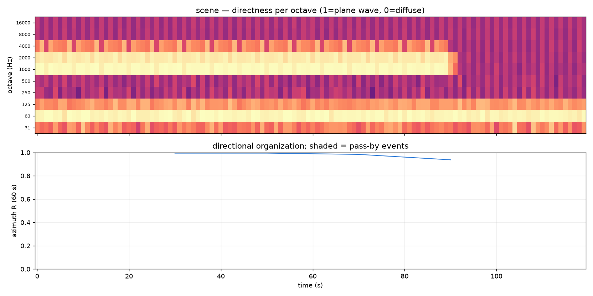

# Spatial dynamics

An ambisonic recording knows not just how loud a scene is but *where it
sounds from*, and how that direction moves. `ambiscape spatial` reads the
cached per-second spatial features (pseudo-intensity per octave, direction
of arrival, diffuseness) and reports three views that no mono corpus tool
can: the direct/diffuse split, moving-source pass-bys, and how
directionally organised the scene is over time.



```bash
ambiscape spatial <session-folder>   # needs a prior analyze run
```

There is no audio pass, since everything comes from the feature cache.
Writes `spatial.json` (`directness_median_per_octave`, `azimuth_R_median`
and its IQR, and a list of `passbys`) and `spatial.png` (directness per
octave over the azimuth-organisation timeline, with pass-by events shaded).

## The three views

- **Direct/diffuse split** (`direct_diffuse_split`): per-octave directness
  in [0, 1], the ratio of pseudo-intensity magnitude to band power. A plane
  wave scores near 1, a diffuse field near 0: the spatial analogue of
  foreground versus background, resolved per frequency band.
- **Pass-by events** (`passby_events`): level events whose per-second
  azimuth sweeps monotonically through the event, so a car going past the
  window is one. Each carries `sweep_deg`, `rate_deg_s`, fit `r2`, and a
  `direction` (left-to-right or right-to-left in the mic frame). The
  defaults require a sweep of at least 25° with R² ≥ 0.7 over ≥ 4 s.
- **Azimuth organisation** (`azimuth_organization`): windowed,
  energy-weighted circular concentration R(t), near 1 when one direction
  dominates, near 0 when the scene is directionally disorganised.

## Directional entropy and horizon split

The module also exposes the summary descriptors used elsewhere in the
corpus:

```python
from ambiscape import spatial

spatial.directional_entropy(F)     # 0 = one bearing, 1 = spread round the horizon
spatial.horizon_fractions(F)       # {'above': .., 'level': .., 'below': ..}
spatial.fg_bg_az_overlap(F)        # do figure and ground share a direction?
```

`directional_entropy` is the spatial analogue of an acoustic diversity
index, which is something only an ambisonic corpus can report. Azimuth
measures cover ambix and (lateral) stereo but not mono, and the horizon split
requires ambix, since neither stereo nor mono resolves elevation.

## Which frame is the bearing in?

Every azimuth above is measured in the recorder's own frame, because that
is the only frame the audio knows about. On a recorder that sits on a
shelf, the two frames coincide and the numbers describe the room. On a
recorder that travels — worn, carried, mounted in a vehicle — they come
apart, and a high `azimuth_R_median` may say only that the rig kept its
pose.

`frame_reference_test` decides between the two, if a heading series exists
alongside the bearings (a compass, a magnetometer, a written-down
orientation per session):

```python
from ambiscape import spatial

spatial.frame_reference_test(
    bearing_deg,          # what the recorder reported
    heading_deg,          # where the recorder's nose pointed, in the world
    control_deg=sway_deg, # a positive control, in the same rig frame
)
# {'R_rig': .., 'R_world': .., 'ratio': .., 'R_chance': .., 'frame': 'rig'}
```

The world bearing is `bearing + heading`, and the answer is simply which
of the two concentrates. `R_chance` is `1/sqrt(n)`, the resultant of `n`
uniformly random angles, and an R below it means nothing at all.

Pass the control. Without one, a result of `'rig'` cannot be told apart
from a method that returns `'rig'` whatever it is given, and that
difference is the whole result.

This question comes before the decode, not after it. A body-worn recorder
carried through 300 days and seven kinds of place — corridors, living
rooms, an auditorium, a train — reported its loudest bearing at R = 0.813
in its own frame against 0.268 in compass coordinates, with the seven
groups' mean bearings only 18 degrees apart: one bearing for a corridor, a
lecture hall and a moving train, because the bearing was the recorder's.
Re-decoding those recordings with the correct channel convention softened
the figures to 0.393 against 0.144 and spread the groups over 45 degrees in
a sensible physical order. A wrong decode makes this worse; a right one
does not fix it.

All of this describes one point of observation, read from a soundfield.
The toolbox holds two sibling paradigms for other microphone layouts: a
[spaced-microphone array](array.md) recovers bearings and a diffuseness
proxy from the arrival-time differences and coherence of a few spaced
omnis in one room, and when several recorders cover several rooms of one
building at once, the [multi-room acoustic network](network.md) makes the
building itself the spatial object—rooms as nodes, walls and doors as
edges.
