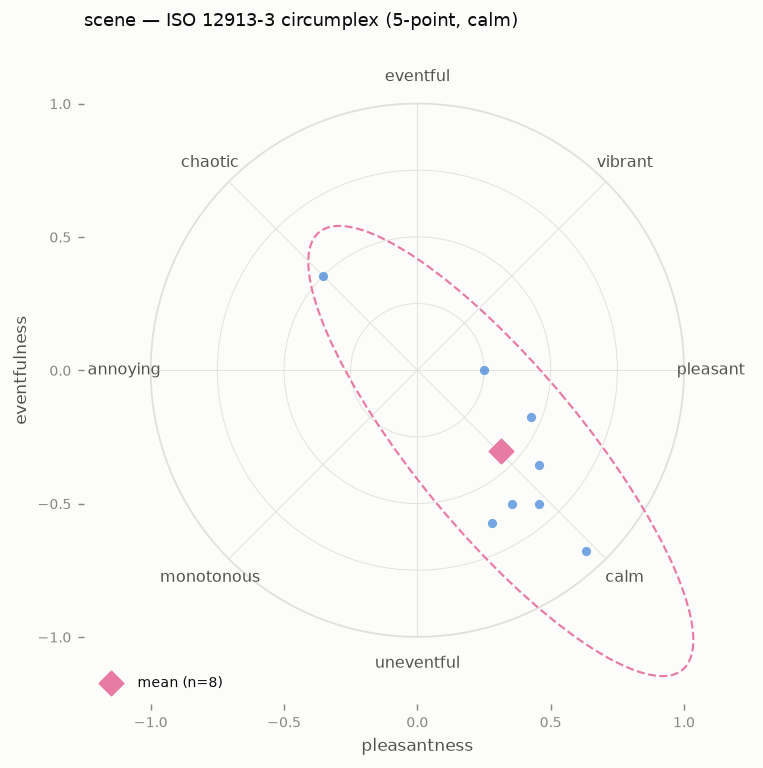

# Perceptual survey (ISO 12913-2)

Everything else in the toolbox measures a soundscape; the `survey` command
asks people. It ingests ISO 12913-2 *Method A* questionnaire responses —
the eight perceived affective qualities *pleasant, chaotic, vibrant,
uneventful, calm, annoying, eventful, monotonous* — and projects them onto
the ISO/TS 12913-3 two-dimensional circumplex:

```
Pleasantness = (p − a) + cos45°·(ca − ch) + cos45°·(v − m)
Eventfulness = (e − u) + cos45°·(ch − ca) + cos45°·(v − m)
```

normalised to [−1, +1], with the familiar quadrant labels: vibrant
(+P, +E), chaotic (−P, +E), monotonous (−P, −E), calm (+P, −E).

```bash
ambiscape survey SESSION/ --responses responses.csv
#   12 respondent(s) (5-point): pleasantness +0.512, eventfulness -0.488
#   -> calm quadrant, dispersion 0.14
#   | measured | value | perceived | value |
#   |---|---|---|---|
#   | LAeq (dBFS) | -38.2 | pleasantness | +0.512 |
#   | events/min | 1.2 | eventfulness | -0.488 |
#   wrote SESSION/analysis/survey.json, survey.png; srv_ keys merged into summary.json
```

`-o` picks the output directory (default `SESSION/analysis`).



## The response CSV

One row per respondent; the eight scale names as columns
(case-insensitive, any order). The coded scale is auto-detected: values
within 1–5 read as the printed 5-point Likert form, anything larger as
the 0–100 digital slider — both normalise to the same circumplex. A
`respondent`/`participant`/`id`/`subject` column (if present) names the
rows; *extra columns* such as appropriateness or loudness ratings ride
along into `survey.json`, with numeric ones averaged into the summary.
Rows with a missing scale value are skipped and counted.

```csv
respondent,pleasant,chaotic,vibrant,uneventful,calm,annoying,eventful,monotonous,loudness
anna,5,1,2,4,5,1,1,2,30
berit,4,1,2,4,4,2,2,2,40
```

## Outputs

- **`survey.png`** — the circumplex: one point per respondent, the mean
  as a diamond, and the 95% covariance ellipse of the respondent cloud
  (drawn for n ≥ 3).
- **`survey.json`** — per-respondent coordinates and raw ratings, mean,
  SD, dispersion (RMS distance from the mean point), quadrant, ellipse
  parameters, and extras.
- **`summary.json`** gains `srv_`-prefixed keys (`srv_n`,
  `srv_pleasantness_mean`, `srv_eventfulness_mean`, `srv_dispersion`,
  `srv_quadrant`, SDs) — the same join as the `vis_` keys from the
  vision module — so [`ambiscape catalog`](catalog.md) ranks a corpus
  perceptually next to the acoustic descriptors:

```bash
ambiscape catalog CORPUS/ --sort srv_pleasantness_mean
```

When the session already has an acoustic `summary.json` (from
`analyze`), the command also prints a short *perception-vs-measurement
table* pairing each available descriptor with the coordinate it is
classically regressed against — LAeq, L90, and NDSI vs pleasantness,
event rate vs eventfulness — and stores the rows in `survey.json` under
`vs_measurement`. That is the dose–response view in miniature: does the
quieter session actually *feel* more pleasant?

## In a notebook

```python
from ambiscape import survey

r = survey.read_responses("responses.csv")     # scale auto-detected
doc = survey.summarize(r)                      # points, mean, ellipse
survey.coordinates({"pleasant": 5, ...})       # one respondent -> (P, E)
survey.run_survey("SESSION/", "responses.csv") # files + summary join
```

!!! note "Protocol vs software"
    This closes the data-handling half of ISO 12913-2: collection
    remains a protocol matter (soundwalk design, instruction wording,
    translation of the scale labels). As with the
    [psychoacoustic indicators](acoustics.md), the honest claim is
    *"12913-2-informed collection, 12913-3 analysis"*, with the
    protocol documented alongside the numbers.
