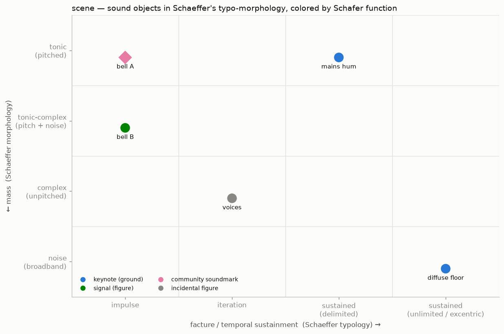
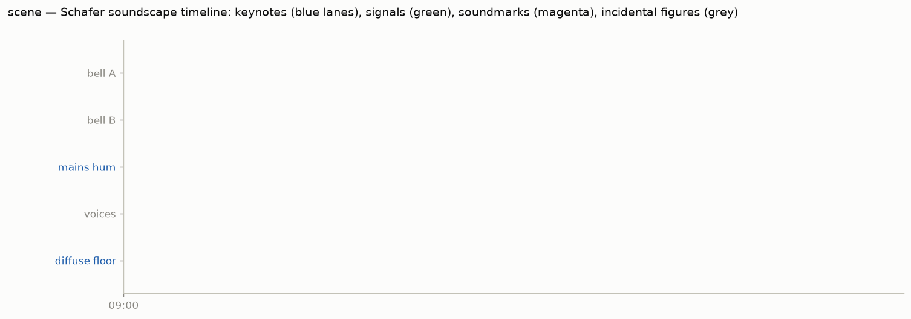

# The taxonomy workflow

Instruments detect *when* things sound; deciding *what they are* — in
Schaeffer's typo-morphology or Schafer's soundscape functions — is a
listening judgment. ambiscape splits the work accordingly:

```
ambiscape draft <folder>      # machine proposes
# ... you listen and edit ...
ambiscape taxonomy <folder>   # machine renders
```

## 1. Draft (`annotations.draft.json`)

From the cached features, `draft` pre-fills:

- **steady-state keynote candidates** — level regimes found by
  change-point detection with a *fixed per-regime reference* (median of the
  regime's first two minutes) and a two-minute confirmation window, so
  transients don't split regimes but machine on/offs do;
- **detected events**, each with listening hints: clock time, exceedance,
  level, azimuth/elevation, diffuseness — and, with the `[ml]` extra,
  AudioSet tag suggestions from PANNs (treat as suggestions to confirm by
  ear, not ground truth).

## 2. Annotate (`annotations.json`)

For each object you set:

| Field | Values |
|---|---|
| `kind` | `keynote` \| `signal` \| `soundmark` \| `figure` |
| `mass` | `tonic` \| `tonic-complex` \| `complex` \| `noise` |
| `facture` | `impulse` \| `iteration` \| `sustained` \| `unlimited` |
| `soundmark` (optional) | `community` \| `dwelling` |
| `source` (optional) | `anthropophony` \| `biophony` \| `geophony` |
| `spans` / `events` | times as `"[D ]HH:MM:SS"` (D = days after day 0) |

plus an optional `states` list for lo-fi spans (e.g., a masking drone).
The full schema is documented in the
[`taxonomy` module](../api.md); worked examples live in the
Intercontinental database's Haarlem and Berlin session folders.

## 3. Render

`taxonomy` produces two figures:

- **Schaeffer map** — every object on the facture × mass plane, colored by
  its Schafer function; a corpus's structure in one glance (keynotes crowd
  the sustained/unlimited columns, signals the impulse/iteration columns).



- **Schafer timeline** — one lane per object on the real session clock:
  keynote bars, signal/soundmark event markers, lo-fi states shaded,
  gap-aware panels for multi-take sessions. Makes claims like *"the
  community soundmark is audible only in hi-fi windows"* visible directly.


