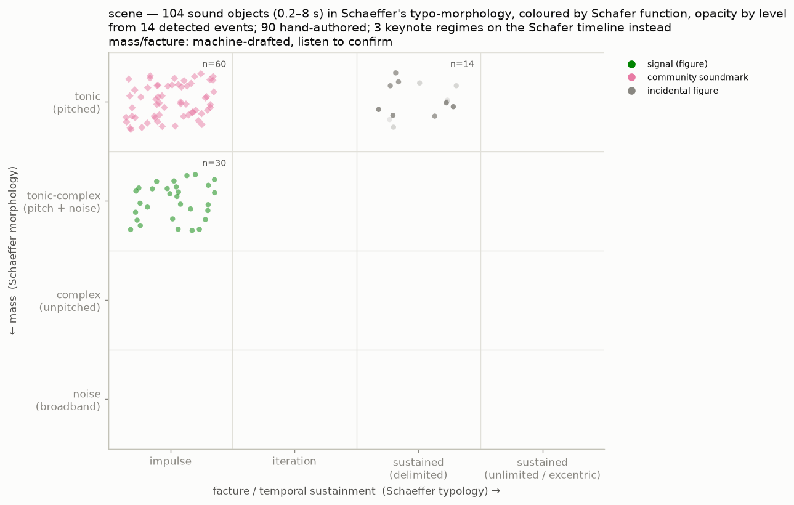
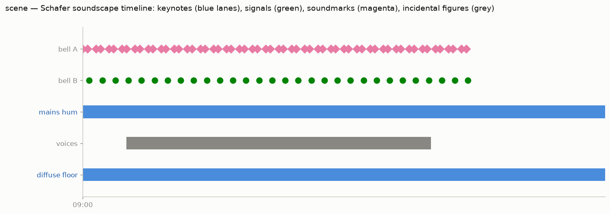

# The taxonomy workflow

## Two different men, two different questions

The annotation schema draws on two traditions whose founders have almost the same name. They are
easy to confuse and they answer different questions, so it is worth separating them before anything
else.

Pierre Schaeffer (1910–1995) asked what a sound *is*, considered on its own terms. His
*Traité des objets musicaux* (1966) describes the sound object through reduced listening, deliberately
setting aside where the sound came from, and classifies it by its internal make-up. In this package
that is the `mass` and `facture` pair, which together place an object on a simplified version of his
typo-morphological grid.

R. Murray Schafer (1933–2021) asked what a sound *does* in a place. *The Soundscape: Our Sonic
Environment and the Tuning of the World* (1977) classifies sounds by the role they play for the
people who live among them: the constant background, the deliberate foreground, the sound that marks
a community. In this package that is `kind` and `soundmark`.

A third, later tradition is also present and belongs to neither of them. Soundscape ecology, after
Bernie Krause and Bryan Pijanowski, divides sound by its physical origin into biophony, geophony and
anthrophony. That is the `source` field.

So the same object carries up to three independent labels, and they do not constrain one another. A
ventilation drone is `noise`/`unlimited` to Schaeffer, a `keynote` to Schafer, and `anthrophony` to
soundscape ecology. Nothing about the first determines the second or the third.

## Two different timescales

The two questions are also asked of different lengths of sound, and this matters more than it looks.

A Schafer **keynote** is a level that persists. The ventilation bed, the motorway a valley away, the
refrigerator: minutes to hours of ground, heard as the condition of a place rather than as anything
happening in it. One does not attend to a keynote; one notices it when it stops.

A Schaeffer **sound object** is what the ear can hold whole in a single act of attention. In the
*Traité* that horizon runs from roughly half a second to about five seconds. Shorter than that and
there is no shape to hear, only a mark; longer and attention stops holding the whole and begins to
follow a texture instead. A door closing, a kettle's rattle, one stroke of a bell: these are sound
objects, and reduced listening is something done to them one at a time.

Placing a keynote regime on the typo-morphology plane therefore asks of an eight-hour ventilation bed
the question Schaeffer asks of a single closing door. The two figures here keep the scales apart. The
**Schaeffer map** is built from detected events, one point per sound object of 0.2–8 s. The **Schafer
timeline** is built from regimes and spans, on the session clock. Neither borrows the other's unit,
and the map shows no regimes at all.

## Morphology without the label (`objects.object_profile`)

Typing an object as impulsive, sustained or iterative discards the
measurements that produced the type. Two objects can share a facture and
differ audibly, and a comparison — do two takes of the same action match?
does a machine's onset resemble a deliberate one? — needs the numbers
rather than the label.

```python
from ambiscape.objects import object_profile
p = object_profile(env, dt)      # env: the object's amplitude envelope
```

| field | what it says |
|---|---|
| `attack_s` | the 10–90 % rise towards the peak |
| `decay_s` | the fall back through a tenth of the peak, or `None` if the sound was cut off rather than allowed to finish |
| `temporal_centroid` | where the energy sits along the object, 0 at its start and 1 at its end |
| `crest_db` | peak over RMS |
| `iteration_hz`, `iteration_strength` | the envelope's best repetition rate and how strongly it repeats |

The temporal centroid is the one worth knowing about. It puts impulsive and
sustained on a continuous axis rather than in categories: an impulse lands
near 0.04 and a held sound near 0.49, so two objects of the same facture
can still be told apart.

These are **meso-band** descriptors in the sense of the
[timescales guide](timescales.md): each is defined on a single object of
roughly 0.2–8 s and none needs a minute of audio. That matters for clip
corpora, where the session-scale descriptors return almost nothing.

## The workflow

Instruments detect *when* things sound. Deciding what they are, in any of the three schemes, is a
listening judgement. The work is split accordingly:

```
ambiscape draft <folder>      # machine proposes
# ... you listen and edit ...
ambiscape taxonomy <folder>   # machine renders
```

## 1. Draft (`annotations.draft.json`)

From the cached features, `draft` pre-fills:

- steady-state keynote *beds*: level regimes found by change-point detection with a fixed
  per-regime reference (median of the regime's first two minutes) and a two-minute confirmation
  window, so a slammed door does not split a regime but switching off the ventilation does. The
  regimes are then clustered by level similarity into beds (~6 dB bands), one draft object per bed
  carrying all of that band's spans, named by the bed's character and extent
  (`"quiet bed, -60 to -54 dBFS, 23 spans"`); the eight longest beds are kept and any remainder is
  pooled into one "other beds" object. A full domestic day therefore drafts as a handful of keynote
  candidates rather than one object per regime. With the `[ml]` extra, each bed also carries a
  `machine hint:` label with the dominant PANNs tag of its longest span, explicitly marked
  unverified;
- detected events, each with listening hints: clock time, exceedance, level, azimuth and elevation,
  diffuseness, and, with the `[ml]` extra, AudioSet tag suggestions from PANNs. Treat those as
  suggestions to confirm by ear, not as ground truth.

Note that the mass and facture the draft proposes here describe *regimes*, and they exist only to
give the annotator a starting point for the bed's character. They are not what the Schaeffer map
plots: the map builds its own objects from the detected events (`ambiscape.objects`, described under
[Render](#the-schaeffer-map-one-point-per-sound-object) below), because a regime is not a sound
object.

For a third view of the same axes, in which every inter-onset segment of a short excerpt is
classified on a simplified TARTYP grid, see `music.tartyp_profile` in [Music](music.md). It needs the
`[music]` extra.

## 2. Annotate (`annotations.json`)

The fields are grouped below by which tradition they come from. Only `spans` and `events` are ours.

Schaeffer, what the sound is in itself:

| Field | Values |
|---|---|
| `mass` | `tonic` \| `tonic-complex` \| `complex` \| `noise` |
| `facture` | `impulse` \| `iteration` \| `sustained` \| `unlimited` |

Schafer, what the sound does in the place:

| Field | Values |
|---|---|
| `kind` | `keynote` \| `signal` \| `soundmark` \| `figure` |
| `soundmark` (optional) | `community` \| `dwelling` |

Soundscape ecology, where the sound physically comes from:

| Field | Values |
|---|---|
| `source` (optional) | `anthrophony` \| `biophony` \| `geophony` |

Timing, ours:

| Field | Values |
|---|---|
| `spans` / `events` | times as `"[D ]HH:MM:SS"` (D = days after day 0) |

There is also an optional `states` list for lo-fi spans, such as a masking drone. Hi-fi and lo-fi are
Schafer's terms as well: a hi-fi soundscape is one where individual sounds can be heard distinctly,
and a lo-fi one is where they are crowded out.

The full schema is documented in the [`taxonomy` module](../api.md), and worked examples live in the
Intercontinental database's Haarlem and Berlin session folders.

## 3. Render

`taxonomy` produces two figures, one per tradition.

### The Schaeffer map: one point per sound object

The map places sound objects on the facture by mass plane, which is Schaeffer's question and his
alone. Its unit is the object, not the regime: the session's detected events — the fast level rising
at least 8 dB over its running background — are filtered to the object duration window (0.2–8 s by
default) and each survivor is typed on both axes from its own signature in the cached features. A
full domestic day yields tens of thousands of them and types in a couple of seconds, with no audio
pass. Keynote regimes are counted in the caption and sent to the timeline, where they belong. The
window is a choice, so it is a flag: `ambiscape taxonomy <folder> --object-window 0.5 5` narrows it
to Schaeffer's own figures, and the caption reports how many detected events fell outside whatever
window you set.

**Mass** comes from the object's *excess* spectrum, that is, what appeared over the running band
background, so a click over a ventilation drone is typed as a click and not as the drone. Two numbers
are read off it, both deliberately blind to overall spectral tilt, since brightness is not mass:

- **peak share**, the fraction of the object's energy sitting in bands that stand 6 dB above the
  running median of their own octave. This is peakiness and harmonicity in one figure: a lone partial
  counts, every member of a harmonic series counts, and a continuum of any shape counts for nothing;
- **spread**, the energy-weighted standard deviation of log2 frequency, in octaves.

| Reading | Mass |
|---|---|
| peak share ≥ 0.50 | `tonic` — most of what appeared is in peaks, so a pitch is what one hears |
| peak share ≥ 0.20 | `tonic-complex` — a pitch audible over a continuum that carries most of the energy |
| spread ≥ 1.2 octaves | `noise` — no pitch, energy spread wide enough to hear as a band of noise |
| otherwise | `complex` — energy in one or a few narrow regions, none of them a pitch |

**Facture** comes from the object's own amplitude envelope, the 20 ms broadband envelope of the
feature cache. Two numbers again: the **attack time**, the conventional 10-to-90 per cent rise
towards the peak, and the **iteration strength**, the normalised envelope autocorrelation at its best
repetition lag between 3 and 20 Hz — a single attack and decay has a monotonically falling
autocorrelation and scores nothing, while a rattle, roll or grain scores at its own period.

| Reading | Facture |
|---|---|
| duration ≥ 5 s | `unlimited` — sustainment outlasting what attention holds whole; Schaeffer's excentric case |
| iteration strength ≥ 0.35, duration ≥ 0.4 s | `iteration` — energy maintained by repetition |
| attack ≤ 0.08 s, duration ≤ 1 s | `impulse` — all the energy arrives at once and nothing maintains it |
| otherwise | `sustained` — energy held continuously between a beginning and an end |

Every object carries the numbers behind both readings under `_schaeffer`, so any proposal can be
traced back to what produced it. And they remain proposals. No public domestic corpus has
object-level ground truth to score them against — activity labels are minutes long, an order of
magnitude coarser than an object — so the caption keeps its "machine-drafted, listen to confirm"
marking and means it.

Each object is one point, jittered inside its cell so that density is visible, with the cell's full
count printed at its corner and opacity tracking the object's level, so the loud objects in a crowded
cell stand out from the quiet ones. Colour is Schafer's `kind` — a convenience, so that you can see
whether the two schemes happen to agree in your corpus — or, with activity annotations, the dominant
concurrent activity. Sessions of tens of thousands of objects are subsampled for the scatter,
stratified by cell so that no occupied cell disappears and stated in the caption; the printed counts
always come from the full census. Hand-authored annotation entries that are themselves object-scale
(events, or spans no longer than the window) join the detected ones and keep their labels where the
map is sparse enough to print them.



### The Schafer timeline: the keynote scale

The Schafer timeline shows the session clock, and it has two layouts; which one you get depends on
whether human activity annotations are available (below). This is where the regimes live, and where
they should be read: minutes and hours of ground, not objects.

**The acoustic-first layout** — the default, and the only one, when no activities are given — gives
one lane per hand-authored object: keynote bars, signal and soundmark event markers, lo-fi states
shaded, and gap-aware panels for multi-take sessions. This is where Schafer's question is answered,
since a sound's function is a claim about how it sits in time and in a place. It makes statements
like "the community soundmark is audible only in hi-fi windows" directly visible.

Machine-drafted steady-state regimes are the one exception to one-lane-per-object: when an
annotation file still contains many of them (an unedited draft, or an older per-regime one), they
are merged at render time into keynote-bed lanes by the same ~6 dB level banding the draft stage
uses — at most eight bed lanes plus "other beds", each labelled with its level range and span count
— so the figure height stays bounded however many regimes a long session proposes. Hand-authored
objects are never merged.



## Human activity ground truth (`--activities`)

Some datasets ship human annotations of what the people in the space were *doing*. The SINS
database (Dekkers et al. 2017) provides per-room activity logs as semicolon-separated CSVs with a
`Class;Start time;Stop time` header and absolute timestamps, and classes such as `absence`,
`sleeping`, `cooking`, `vacuumcleaner` or `watching_tv`. Both figures can overlay them:

```
ambiscape taxonomy <folder> --activities living_labels.csv
```

(or `taxonomy.render(folder, activities=...)` / the `activities` parameter of `schaeffer_map` and
`schafer_timeline` in the library, taking the list returned by `taxonomy.load_activities`). The
spans are aligned to the session clock via the session's day 0; if the file is missing the figures
render exactly as without the option.

### The activity-first timeline

With activities present the timeline inverts, by default, into the **activity-first layout**: the
human activities become the organising structure, not an overlay on the acoustic one. Each activity
class gets a lane of its own, ordered by total time (longest first), with classes under ~0.5% of the
session's labelled time pooled into an `other` lane at the bottom of the block. Each span's fill is
coloured by its measured acoustics — the median fast level within the span, in dB re the day's
median level, on the same palette as the cross-node day figures — so loud cooking and quiet cooking
read differently at a glance, and a vacuum-cleaner lane lights up against a dark absence lane. Lane
labels carry the acoustic summary computed from the session's cached features:
`"watching tv — 2.1 h, median −41 dBFS"`.

Hand-authored signals and soundmarks keep their own lanes and markers; the machine-drafted
keynote-bed structure no longer dominates the figure but is compacted into a single strip
(`keynote beds — machine draft, 62 spans`), its spans coloured by bed level on the same scale; the
events lane stays at the foot; lo-fi states remain shaded.

Which layout applies:

- no `--activities`: the acoustic-first lane timeline, exactly as before;
- `--activities <csv>`: the activity-first layout (`--layout auto`, the default, or
  `--layout activity`);
- `--activities <csv> --layout acoustic`: the acoustic-first lane timeline with the activity
  material as before — a compact ribbon of coloured class spans along the top (class legend shared
  with the map; `absence` and `other` deliberately muted so that colour means somebody was doing
  something), and each machine keynote bed's label gains its dominant concurrent activities by time
  share: `"quiet bed, -60 to -54 dBFS, 23 spans — during: absence 71%, sleeping 22%"`.

In the library this is `schafer_timeline(..., F=..., layout=...)`, where `F` is the features dict
from `features.load_features`; `render` loads the session's cached features itself when the
activity-first layout needs them (without a cache the figure still renders, with neutral span fills
and duration-only labels).

### The map with activities

On the map, points take the colour of their dominant concurrent activity instead of their Schafer
kind, with the class colours shared with the timeline ribbon's legend, and points that carry text
(sparse maps, or cell-singleton outliers) also say during which activity they occur
(`"— during cooking"`). Since every point is now one sound object, the colouring says which cells of
the plane a household activity fills: dishwashing lands in impulse and noise, watching television
fills the sustained column at every mass.

The two provenances are never conflated. The activities are **data** — human annotations shipped
with the dataset, attributed in the caption (`activities: human annotations, Dekkers et al. 2017`) —
while mass/facture, the level measurements and the bed structure remain machine output: the beds
keep their "listen to confirm" marking, and the acoustic summaries are measured, not judged. Note
also the scale mismatch: an activity label runs for minutes and a sound object for seconds, so the
activity colour says what was going on around the object, never what the object is.

## A note on spelling

The field value is `anthrophony`, which is the spelling Pijanowski and most of the soundscape-ecology
literature use. Both forms appear in print, and the package also accepts
the older `anthropophony` spelling when reading an annotation file, so
existing annotations keep working; everything it writes uses `anthrophony`.
