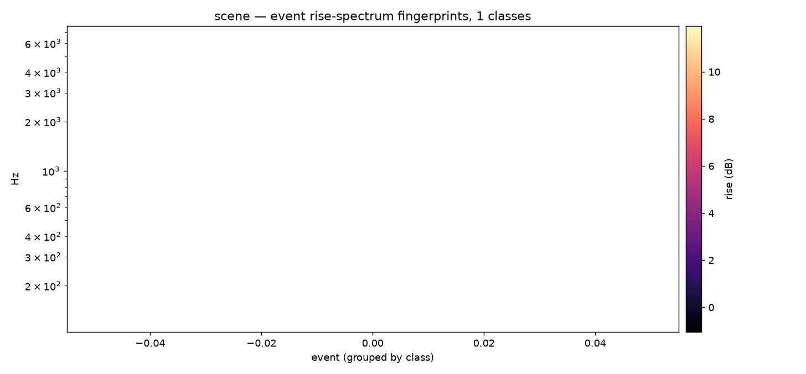

# Event timbre templates

A soundscape repeats itself: the same door, the same cup, the same bird call
recur through a session. `ambiscape timbre` finds those recurring event
classes without any machine learning. Every transient gets a spectral
fingerprint — the strike-triggered **rise spectrum** (what appeared) plus a
per-band **decay slope** (how it faded) — and the fingerprints are clustered
by correlation distance into transparent, corpus-comparable template
classes. It complements the PANNs sound-event tagger (`[ml]`) with a fully
inspectable, no-model alternative.



```bash
ambiscape timbre <session-folder>   # needs a prior analyze run
```

Uses the cached spectral events to place onsets, then reads short windows of
audio around each onset to build the fingerprints. Writes `timbre.json`
(`n_events_fingerprinted`, `n_classes`, `n_unclustered`, and a `classes`
list) and `timbre.png` (the fingerprints as a heatmap, grouped by class).

## Reading a class

Each entry in `classes` describes one recurring sound:

- **`n`** — how many events fell into the class;
- **`exemplar_t0_s`** — onset times of up to five members, to go and listen;
- **`centroid_hz`** — the fingerprint's spectral centroid, a rough "how
  bright";
- **`decay_median_db_s`** — the median decay slope over the bands the event
  actually excited: sharply negative for a plucked or struck sound, near
  zero for a sustained one.

Classes are sorted by count. Singletons that match nothing are left
unclustered (`n_unclustered`) rather than forced into a class.

## In Python

```python
from ambiscape import timbre

rise, slope, centers = timbre.event_fingerprint(take, t_onset=123.4)
labels = timbre.cluster_events(fingerprints)   # -1 = unclustered singleton
```

Clustering is average-linkage on correlation distance with a 0.35 threshold;
two events are "the same sound again" when their rise spectra correlate
tightly. Because there is no trained model, the classes mean exactly what
the fingerprints say and compare directly across sessions.
