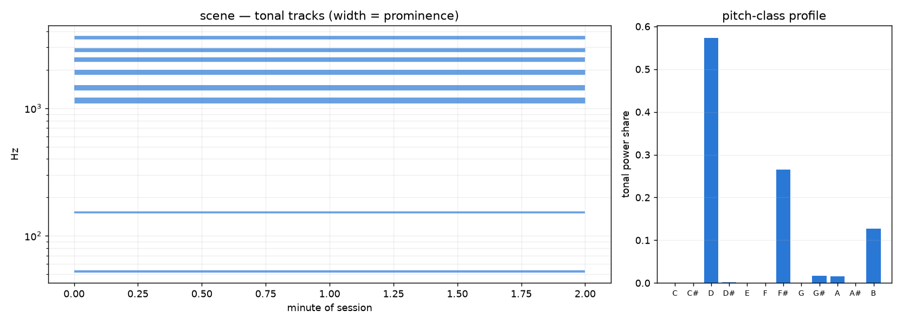

# Tonality: tracks, harmonicity, and key

Much of what makes a soundscape recognisable is tonal: a mains hum, a bell
partial, a beep, a distant engine, a voice. `ambiscape tonality` reads the
cached per-minute mean spectrum and reports the tonal content four ways —
the tonalness timeline as linked tracks, how harmonic that content is, and
what "key" the place hums in.



```bash
ambiscape tonality <session-folder>   # needs a prior analyze run
```

Works entirely from the cache — no audio pass. Writes `tonality.json`
(`tracks`, `tonalness_median`, `harmonicity_median`, `inharmonicity_median`,
a 12-bin `pitch_class_profile` and `top_pitch_classes`) and `tonality.png`
(the tonal tracks over session minutes beside the pitch-class bars).

## The four layers

- **Tonal peaks** — narrowband components rising a set prominence (default
  8 dB) above a running spectral floor: the raw material.
- **Tonal tracks** (`tonal_tracks`) — peaks linked across minutes into
  tracks, each with `f_median_hz`, its span of minutes, mean
  `prominence_db`, and `drift_cents`. A steady hum is a long flat track; a
  warming engine drifts.
- **Harmonic sieve** (`harmonic_sieve`) — the best f0 that explains a
  minute's peaks as a harmonic series k·f0. `harmonicity` is the explained
  power fraction; `1 − harmonicity` is the inharmonicity index. Voices,
  engines and music score high; **bells score low**, since their partial
  series (roughly 1 : 2 : 2.4 : 3 : 4) is not harmonic.
- **Pitch-class profile** (`pitch_class_profile`) — tonal peak energy folded
  onto the 12 pitch classes (A4 = 440 Hz): what note the soundscape sits on.

## In Python

```python
from ambiscape import tonality

tracks = tonality.tonal_tracks(minspec, freqs)     # sorted longest-first
f0, harmonicity = tonality.harmonic_sieve(fq, power)
pcp = tonality.pitch_class_profile(minspec, freqs)  # 12-vector, sums to 1
```

Read `harmonicity_median` beside the carillon and rhythm analyses: a low
median with strong tonal tracks is the signature of bell-like, inharmonic
sources, and a high median points to voices, engines, or music.
