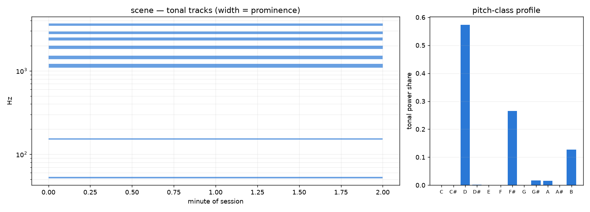

# Tonality: tracks, harmonicity, and key

Much of what makes a soundscape recognisable is tonal: a mains hum, a bell
partial, a beep, a distant engine, a voice. `ambiscape tonality` reads the
cached per-minute mean spectrum and reports the tonal content four ways:
the narrowband tonal peaks, those peaks linked across minutes into tracks,
how harmonic the content is, and what "key" the place hums in.



```bash
ambiscape tonality <session-folder>   # needs a prior analyze run
```

Works entirely from the cache, with no audio pass. Writes `tonality.json`
(`tracks`, `tonalness_median`, `harmonicity_median`, `inharmonicity_median`,
a 12-bin `pitch_class_profile` and `top_pitch_classes`) and `tonality.png`
(the tonal tracks over session minutes beside the pitch-class bars).

## The four layers

- **Tonal peaks**: narrowband components rising a set prominence (default
  8 dB) above a running spectral floor, the raw material.
- **Tonal tracks** (`tonal_tracks`): peaks linked across minutes into
  tracks, each with `f_median_hz`, its span of minutes, mean
  `prominence_db`, and `drift_cents`. A steady hum is a long flat track; a
  warming engine drifts.
- **Harmonic sieve** (`harmonic_sieve`): the best f0 that explains a
  minute's peaks as a harmonic series k·f0. `harmonicity` is the explained
  power fraction; `1 − harmonicity` is the inharmonicity index. Voices,
  engines and music score high; bells score low, since their partial
  series (roughly 1 : 2 : 2.4 : 3 : 4) is not harmonic.
- **Pitch-class profile** (`pitch_class_profile`): tonal peak energy folded
  onto the 12 pitch classes (A4 = 440 Hz), or what note the soundscape sits
  on.

## In Python

```python
from ambiscape import tonality

tracks = tonality.tonal_tracks(minspec, freqs)     # sorted longest-first
f0, harmonicity = tonality.harmonic_sieve(fq, power)
pcp = tonality.pitch_class_profile(minspec, freqs)  # 12-vector, sums to 1
```

Read `harmonicity_median` beside the carillon and rhythm analyses: a low
median with strong tonal tracks is the signature of bell-like, inharmonic
sources, and a high median points to voices, engines, or music.

### On machinery, change all three defaults

`harmonic_sieve` is tuned for voices and music, and its parameters choose
between defensible answers rather than merely setting precision. A
dishwasher's circulation pump, whose strong low peaks put its shaft near
46 Hz, shows each:

| parameter | default | what it gives on the pump |
|---|---|---|
| `f0_min` | 60 Hz | above the shaft, so the second harmonic, 91.9 Hz |
| `tol_cents` | 35 | a different fundamental, 68.6 Hz at harmonicity 0.73 |
| `max_harm` | 12 | short for a comb tracked to k = 26 |

The tolerance is the one to watch, because a cents window is proportional:
35 cents is ±5.6 Hz at 275 Hz but ±17 Hz at 825 Hz, wide enough to collect
high harmonics by coincidence. The loose fit above *scores higher* than the
tight one, 0.73 against 0.45, while explaining nine of twenty-seven peaks
rather than fourteen, fitting the strongest peak less exactly and missing
the second-strongest by two semitones.

```python
f0, harmonicity = tonality.harmonic_sieve(
    fq, power, f0_min=40.0, tol_cents=8.0, max_harm=28)
```

Quote a harmonicity with the tolerance it was computed at. On its own it
does not say which series was chosen.
