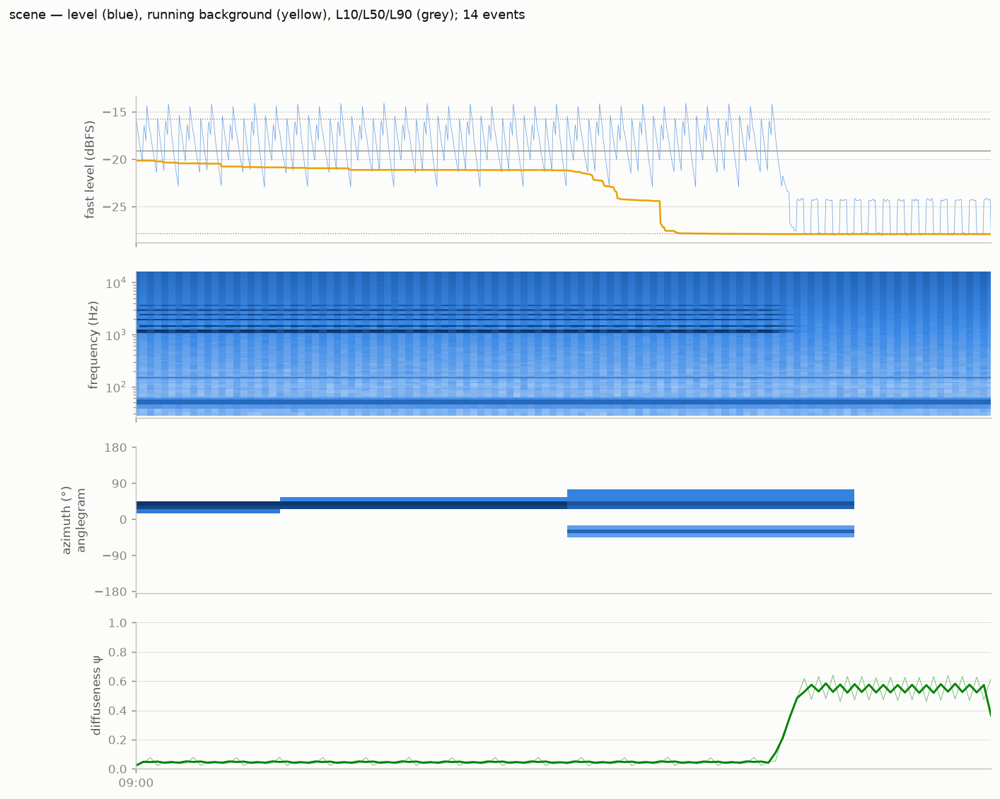

# ambiscape

A holistic toolbox for analysing soundscapes, the sonic ambiences of
rooms, streets, and landscapes, from any recording: mono, stereo,
binaural, or first-order ambisonic. It brings level, spectral, spatial,
temporal, ecological, and source-domain descriptors into one picture, and
streams recordings of any length (minutes to whole nights) in constant memory.
It is built for several kinds of reader at once: acousticians and soundscape
ecologists, sound artists and composers, students, and anyone curious about
the sound of a place.

## Why

Most audio analysis tooling assumes a file you can load whole. Long-form
field recording produces something else: tens of gigabytes per session,
split into 2 GB files by the recorder, in which the interesting structure
lives at time scales of minutes to hours, such as machine duty cycles,
diurnal traffic envelopes and day/night state changes. The *session*—a
folder of WAVs on one absolute clock—is therefore the unit of analysis,
and ambiscape produces:

- **descriptors** in the environmental-acoustics idiom (Leq, LAeq,
  L10/L50/L90, event statistics), with a sensor-noise-floor guard that
  flags bands whose low-percentile levels measure the recorder's
  self-noise rather than the room,
- **spatial timelines** when the recording carries direction: full
  direction of arrival, diffuseness and azimuthal concentration from
  ambisonics, a lateral left/right cue from stereo,
- **source decomposition**: geophony, biophony, anthrophony, and
  mechanical/transport indices, plus two separate annotation layers, one for
  Schaeffer's typo-morphology and one for Schafer's soundscape functions,
- **figures** (session overview, percentile spectra, directograms,
  taxonomy maps and timelines),
- **room acoustics**: T60 from claps or incidental impulses, swept-sine
  impulse-response measurement (T60/EDT, clarity, STI, IACC), and
  auralization through a measured room,
- **machine states**: on/off segmentation, duty cycles, source spectral
  fingerprints, and targeted civic-grid scans (church clocks, sirens),
- **mains hum / ENF**: millihertz tracking of the electric network
  frequency for grid forensics and hum characterisation,
- **ratings & global indices**: NR/NC/RC room criteria, intermittency
  ratio and emergence, the ecoacoustic battery (ACI, ADI/AEI, NDSI, BI,
  H), EDT/C50/C80/D50, and spatial descriptors (directional entropy,
  horizon fractions, foreground/background direction overlap),
- **biophony**: structural measures of nature/animal sound (narrowband
  activity, temporal entropy, spatial dispersion) plus an optional BirdNET
  species layer gated to hi-fi windows,
- **strike-level rhythm** of quasi-periodic sources such as bells and
  machines, with periodicity, phase, and repetition-vs-variation statistics,
- **ISO 12913-3 psychoacoustic indicators** and a calibration hook,
- **ISO 12913-2 perceptual surveys**: Method-A questionnaire responses
  projected onto the 12913-3 circumplex (per-respondent points, mean,
  95% ellipse), joined into the session summary for perceptual ranking,
- **machine-listening assists** (AudioSet tagging, a speech privacy gate),
- **multimodal joins**: per-frame visual features from a companion camera,
  and sound–motion entrainment against a body-worn accelerometer,
- **publication exports** (non-identifying 1 Hz features; curated segment
  selection),
- **multi-recorder networks**: one recorder per room of a building on a
  common clock, read as a coupling graph—edge strengths and lead/lag
  directions between rooms, the acoustic hub, and the graph's density
  over the day,
- **corpus aggregation**: one cross-session table (CSV + Markdown) from
  every session's cached summary, with ranking and outlier queries.

## Relationship to ambiviz

ambiscape is the streaming companion to
[ambiviz](https://github.com/fisheggg/ambiviz). ambiviz renders rich
spatial visuals (AEM spherical energy maps, anglegrams, directograms) from
audio it can load whole; ambiscape summarises recordings too long for that,
and selects the short representative excerpts that ambiviz then visualises
in detail. ambiscape follows ambiviz's plot names and conventions where the
two overlap.

## Where things are documented

- **This site**—user guide, [command overview](cli.md), and API
  reference, versioned with the code.
- **[README](https://github.com/fourMs/ambiscape#readme)**—install and
  a one-page overview.
- **[Wiki](https://github.com/fourMs/ambiscape/wiki)**—field-recording
  protocol, recipes, worked case studies, design rationale, and research
  context.

## Citing

Jensenius, A. R., & Guo, J. (2026). *ambiscape: analysis of soundscapes from mono, stereo, binaural and ambisonic recordings* [Computer software]. Zenodo.
<https://doi.org/10.5281/zenodo.21965234>

That is the concept DOI and it always resolves to the newest version. Where the exact behaviour
matters, add the version you ran; every release has its own DOI, listed on the Zenodo record.
